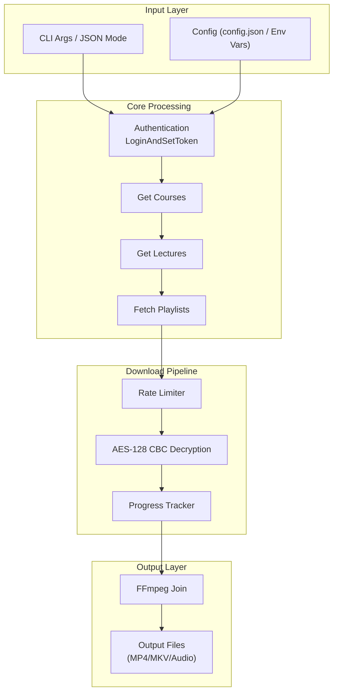

<!-- START doctoc generated TOC please keep comment here to allow auto update -->
**Table of Contents**  *generated automatically*

<!---toc start-->

* [AGENTS.md - AI Agent Guide for Impartus CLI](#agentsmd---ai-agent-guide-for-impartus-cli)
  * [Purpose](#purpose)
  * [Issue Tracking](#issue-tracking)
  * [Architecture Quick Reference](#architecture-quick-reference)
    * [Entry Points](#entry-points)
    * [Flow](#flow)
    * [Package Map](#package-map)
    * [Data Flow](#data-flow)
  * [Critical Files to Understand](#critical-files-to-understand)
  * [Making Changes](#making-changes)
    * [Adding a New CLI Command](#adding-a-new-cli-command)
    * [Adding a New API Endpoint](#adding-a-new-api-endpoint)
    * [Modifying Config](#modifying-config)
    * [Adding Download Features](#adding-download-features)
  * [Common Patterns](#common-patterns)
    * [Error Handling](#error-handling)
    * [JSON Envelope Pattern](#json-envelope-pattern)
    * [Testing Patterns](#testing-patterns)
    * [Context Usage](#context-usage)
    * [Dependency Injection](#dependency-injection)
  * [Key Dependencies](#key-dependencies)
    * [External Packages](#external-packages)
    * [Internal Package Dependencies](#internal-package-dependencies)
  * [Debugging Tips](#debugging-tips)
    * [CLI Issues](#cli-issues)
    * [API Issues](#api-issues)
    * [Download Issues](#download-issues)
  * [Performance Considerations](#performance-considerations)
    * [Rate Limiting Configuration](#rate-limiting-configuration)
    * [Pipeline Parallelization](#pipeline-parallelization)
    * [Memory Management](#memory-management)
  * [Security Notes](#security-notes)
    * [Credential Handling](#credential-handling)
    * [Token Management](#token-management)
    * [Log Scrubbing](#log-scrubbing)
  * [Code Quality](#code-quality)
    * [Linting](#linting)
    * [Pre-commit Hooks](#pre-commit-hooks)
    * [Testing](#testing)
* [Run all tests](#run-all-tests)
* [Run with coverage](#run-with-coverage)
* [View coverage](#view-coverage)
    * [CI/CD](#cicd)
  * [Issue & PR Labels](#issue--pr-labels)
  * [OpenClaw Integration](#openclaw-integration)
    * [Tool Manifest](#tool-manifest)
    * [JSON Mode Usage](#json-mode-usage)
    * [API Reference](#api-reference)

<!---toc end-->
<!-- END doctoc generated TOC please keep comment here to allow auto update -->


# AGENTS.md - AI Agent Guide for Impartus CLI

> This file helps AI coding agents understand the codebase efficiently for making changes, debugging, and adding features.

---

## Purpose

Impartus CLI is a Go application for downloading video lectures from the Impartus educational platform. It supports:
- **CLI mode**: Interactive and command-line interface for downloading lectures
- **API mode**: REST + WebSocket server for programmatic access
- **JSON mode**: Machine-readable output for AI agent integration

---

<!-- bd:onboard:start -->
## Issue Tracking

This project uses **bd (beads)** for issue tracking.
Run `bd prime` for workflow context, or install hooks (`bd hooks install`) for auto-injection.

**Quick reference:**
- `bd ready` - Find unblocked work
- `bd create "Title" --type task --priority 2` - Create issue
- `bd close <id>` - Complete work
- `bd sync` - Sync with git (run at session end)

For full workflow details: `bd prime`
<!-- bd:onboard:end -->

---

## Architecture Quick Reference

### Entry Points

| File | Purpose |
|------|---------|
| `main.go` | Root binary entry, calls `cli.Execute()` |
| `cmd/impartus/main.go` | Module entrypoint (same as main.go) |
| `internal/cli/cli.go` | Command routing, flag parsing, JSON envelope |

### Flow

```
main.go → cli.Execute(version, date) → Command Handlers
                                            │
                    ┌───────────────────────┼───────────────────────┐
                    │                       │                       │
              Interactive              courses/lectures        download/serve
                 Mode                   Commands                Commands
                    │                       │                       │
                    ▼                       ▼                       ▼
              initClient()          initClient()             initClient()
                    │                       │                       │
                    └───────────────────────┼───────────────────────┘
                                            │
                                    client.Client
                                            │
                                    downloader.Downloader
                                            │
                                    FFmpeg Join → Output Files
```

### Package Map

| Package | Responsibility | Key Files |
|---------|---------------|-----------|
| `cli` | CLI commands, JSON envelope, interactive mode | `cli.go`, `cli_test.go` |
| `client` | HTTP client, API calls, playlist parsing | `client.go`, `http.go`, `types.go` |
| `config` | Configuration loading, validation, defaults | `config.go`, `config_test.go` |
| `downloader` | Chunk download, AES decryption, FFmpeg operations | `downloader.go`, `pipeline.go`, `ffmpeg.go`, `rate_limiter.go`, `progress_tracker.go` |
| `server` | REST API, WebSocket, job management | `server.go`, `auth.go`, `job_runner.go` |
| `alerts` | Webhook alerting (Slack, PagerDuty) | `alerts.go` |
| `metrics` | OpenTelemetry metrics instrumentation | `metrics.go` |
| `sentryhook` | Sentry error tracking integration | `sentryhook.go` |
| `logutil` | Log sanitization for sensitive data | `logutil.go` |

### Data Flow



---

## Critical Files to Understand

| File | Purpose |
|------|---------|
| `internal/cli/cli.go` | Command routing, JSON envelope format, flag parsing. All CLI commands enter here. |
| `internal/client/client.go` | HTTP client with token management, course/lecture fetching, playlist parsing. Core API interaction. |
| `internal/config/config.go` | Config loading from file and env vars, validation, defaults. Singleton pattern via `Get()`. |
| `internal/downloader/downloader.go` | Main download logic: chunk downloads, AES decryption, retry logic, FFmpeg joining. |
| `internal/downloader/pipeline.go` | Concurrent pipeline: download workers + decrypt workers for parallel processing. |
| `internal/server/server.go` | REST API handlers, job store, WebSocket broadcasting, job execution orchestration. |
| `internal/server/auth.go` | Token generation, storage, validation for API auth. |

---

## Making Changes

### Adding a New CLI Command

1. **Add flag definitions** in `internal/cli/cli.go`:
   ```go
   func runNewCommand(args []string) error {
       fs := flag.NewFlagSet("newcommand", flag.ContinueOnError)
       fs.SetOutput(io.Discard)
       myFlag := fs.String("myflag", "", "Description")
       if err := fs.Parse(args); err != nil { return err }
       // ... implementation
   }
   ```

2. **Add route in `Execute()`**:
   ```go
   case "newcommand":
       return runNewCommand(args[1:])
   ```

3. **Add JSON mode support** in `executeJSON()`:
   ```go
   case "newcommand":
       result, err := runNewCommandJSON(args[1:])
       if err != nil { return newJSONError("newcommand", err) }
       return emitJSONEnvelope(newSuccessEnvelope("newcommand", result))
   ```

4. **Update help text** in `showHelp()` and `helpPayload()`.

5. **Add tests** in `internal/cli/cli_test.go`.

### Adding a New API Endpoint

1. **Define route** in `registerRoutes()` in `internal/server/server.go`:
   ```go
   protected.HandleFunc("/new-endpoint", s.newEndpointHandler).Methods(http.MethodPost)
   ```

2. **Create handler** following the pattern:
   ```go
   func (s *APIServer) newEndpointHandler(w http.ResponseWriter, r *http.Request) {
       // Parse request
       var req myRequest
       if err := json.NewDecoder(r.Body).Decode(&req); err != nil {
           respondWithError(w, http.StatusBadRequest, "INVALID_REQUEST", "Invalid request body")
           return
       }
       
       // Validate
       if req.Required == "" {
           respondWithError(w, http.StatusBadRequest, "MISSING_PARAMETER", "required is required")
           return
       }
       
       // Process
       result := doSomething(req)
       
       // Response
       writeJSON(w, http.StatusOK, result)
   }
   ```

3. **Broadcast WebSocket events** for real-time updates:
   ```go
   broadcastEvent(s.wsHub, map[string]any{
       "type": "something.happened",
       "data": result,
       "timestamp": time.Now().Unix(),
   })
   ```

4. **Add tests** in `internal/server/server_test.go`.

### Modifying Config

1. **Add field** to `Config` struct in `internal/config/config.go`:
   ```go
   type Config struct {
       // existing fields...
       NewField string `json:"newField"`
   }
   ```

2. **Add default** in `ApplyDefaults()`:
   ```go
   if c.NewField == "" {
       c.NewField = "default_value"
   }
   ```

3. **Add validation** in `Validate()`:
   ```go
   if c.NewField != "" && !isValid(c.NewField) {
       return fmt.Errorf("newField must be valid")
   }
   ```

4. **Add environment override** in `applyEnvOverrides()`:
   ```go
   applyStringEnv("IMPARTUS_NEW_FIELD", &c.NewField)
   ```

5. **Update `sample.config.json`** with documentation.

### Adding Download Features

1. **Modify `Downloader` struct** in `internal/downloader/downloader.go` for new fields.

2. **Pipeline changes** go in `internal/downloader/pipeline.go`:
   - Add new task types to `ChunkTask` or create new structs
   - Modify `downloadWorker()` or `decryptWorker()` for processing changes
   - Update `PipelineResult` for new output fields

3. **FFmpeg operations** in `internal/downloader/ffmpeg.go`:
   - Add new methods for different output formats
   - Use `validateFFmpegArgs()` for argument validation

4. **Rate limiting** changes go in `internal/downloader/rate_limiter.go`.

5. **Progress tracking** changes in `internal/downloader/progress_tracker.go`.

---

## Common Patterns

### Error Handling

Errors are created/wrapped using `fmt.Errorf` with `%w`:
```go
if err != nil {
    return nil, fmt.Errorf("failed to fetch playlists: %w", err)
}
```

API errors use structured responses:
```go
respondWithError(w, http.StatusBadGateway, "LOGIN_FAILED", err.Error())
```

### JSON Envelope Pattern

All JSON responses use this envelope:
```go
type jsonEnvelope struct {
    Success bool     `json:"success"`
    Data    any      `json:"data"`
    Error   *jsonErr `json:"error"`
    Meta    jsonMeta `json:"meta"`
}
```

Create with helper functions:
```go
emitJSONEnvelope(newSuccessEnvelope("command", data))
newJSONError("command", err)
```

### Testing Patterns

Use table-driven tests:
```go
func TestSomething(t *testing.T) {
    tests := []struct {
        name    string
        input   string
        want    string
        wantErr bool
    }{
        {"valid", "input", "expected", false},
        {"invalid", "bad", "", true},
    }
    for _, tt := range tests {
        t.Run(tt.name, func(t *testing.T) {
            // test implementation
        })
    }
}
```

Mock HTTP client for tests:
```go
type mockHTTPClient struct {
    response *http.Response
    err      error
}
```

### Context Usage

Context flows through the call chain for cancellation:
```go
func (d *Downloader) DownloadPlaylist(ctx context.Context, ...) error {
    // Check cancellation
    select {
    case <-ctx.Done():
        return ctx.Err()
    default:
    }
    // ... downloading
}
```

### Dependency Injection

Components are injected for testability:
```go
func New(cfg *config.Config, apiClient *client.Client) *Downloader {
    if cfg == nil {
        cfg = &config.Config{}
    }
    cfg.ApplyDefaults()
    if apiClient == nil {
        apiClient = client.New(nil, nil)
    }
    return &Downloader{...}
}
```

---

## Key Dependencies

### External Packages

| Package | Purpose |
|---------|---------|
| `github.com/gorilla/mux` | HTTP router with URL variables and middleware |
| `github.com/gorilla/websocket` | WebSocket server for real-time job updates |
| `github.com/google/uuid` | UUID generation for request IDs and tokens |
| `github.com/vbauerster/mpb/v8` | Multi-progress bar for CLI downloads |
| `golang.org/x/time/rate` | Token bucket rate limiting |
| `go.opentelemetry.io/otel` | OpenTelemetry metrics SDK |
| `github.com/getsentry/sentry-go` | Sentry error tracking |

### Internal Package Dependencies

```
cli
  ├── client (API calls)
  ├── config (configuration)
  ├── downloader (video processing)
  └── server (API server mode)

downloader
  ├── client (HTTP requests)
  └── config (settings)

server
  ├── client (API interactions)
  ├── downloader (job execution)
  └── config (settings)
```

---

## Debugging Tips

### CLI Issues

| Problem | Solution |
|---------|----------|
| "authentication failed" | Check `config.json` username/password, check base URL |
| "please add ffmpeg to your path" | Install FFmpeg and ensure it's in `$PATH` |
| Token issues | Delete `.token` file to force re-authentication |
| Rate limiting errors | Adjust `rateLimit` and `apiRateLimit` in config |

Debug with verbose output:
```go
log.Printf("Fetching playlists for lecture %d", lecture.Ttid)
```

### API Issues

| Problem | Solution |
|---------|----------|
| 401 Unauthorized | Token expired or invalid, re-login required |
| 500 Internal Error | Check `api.log` for stack traces |
| WebSocket disconnection | Check client reconnection logic |

Enable logging:
```go
// In server.go Start()
logFile, err := os.OpenFile("api.log", os.O_RDWR|os.O_CREATE|os.O_APPEND, 0o666)
log.SetOutput(logFile)
```

### Download Issues

| Problem | Solution |
|---------|----------|
| Chunk download failures | Check `RateLimiter.WaitForDownload()` context cancellation |
| Decryption errors | Validate AES key length (16/24/32 bytes), check `.temp` file creation |
| FFmpeg join failures | Check FFmpeg installation, validate input paths exist |

Debug pipeline:
```go
// In downloader.go
log.Printf("Downloaded %d bytes for chunk %d", bytesWritten, chunk)
```

---

## Performance Considerations

### Rate Limiting Configuration

In `config.json`:
```json
{
  "rateLimit": 10,
  "apiRateLimit": 2,
  "enableJitter": true
}
```

### Pipeline Parallelization

When `enablePipeline: true`:
- `downloadWorkersPerLecture`: Concurrent chunk downloads (default: 3)
- `decryptWorkersPerLecture`: Concurrent AES decryptions (default: 2)
- Efficient when `downloadWorkers >= decryptWorkers`

### Memory Management

- Temporary files stored in `tempDirLocation` (default: `./.temp`)
- Chunks written to disk immediately, not held in memory
- Large file handling via streaming (`io.Copy`)

---

## Security Notes

### Credential Handling

**Never commit** authentication data. Use:
- `config.json` (gitignored via `.gitignore`)
- Environment variables: `IMPARTUS_USERNAME`, `IMPARTUS_PASSWORD`, `IMPARTUS_BASE_URL`

### Token Management

- Tokens stored in `.token` file (mode: 0600)
- Token validation via `/user/profile` endpoint
- Re-authentication on token expiry

### Log Scrubbing

Use `internal/logutil` to prevent leaking sensitive data:
```go
import "github.com/rabesss/impartus-cli/internal/logutil"

// Redact passwords, tokens, emails (security utility)
log.Println(logutil.RedactSensitive(message))

// Sanitize maps before logging
safeMap := logutil.SanitizeMap(configMap)
```

---

## Code Quality

### Linting

Run with `make lint` or `golangci-lint run`.

Configuration: `.golangci.yml` enforces:
- Cyclomatic complexity: max 15
- Cognitive complexity: max 30
- Function length: max 100 lines

### Pre-commit Hooks

```bash
pip install pre-commit && pre-commit install
pre-commit run --all-files
```

### Testing

```bash
# Run all tests
go test ./...

# Run with coverage
go test ./... -cover -coverprofile=coverage.out

# View coverage
go tool cover -func=coverage.out
```

Coverage threshold: **40%** minimum.

### CI/CD

GitHub Actions workflow: `.github/workflows/ci.yml`
- Runs on push/PR to `main`
- Jobs: `lint`, `test`, `build`
- Coverage reports uploaded to Codecov

---

## Issue & PR Labels

| Category | Labels |
|----------|--------|
| **Priority** | `priority: critical`, `priority: high`, `priority: medium`, `priority: low` |
| **Type** | `type: bug`, `type: feature`, `type: chore`, `type: documentation` |
| **Area** | `area: cli`, `area: api`, `area: downloader`, `area: config`, `area: tests` |
| **Status** | `status: blocked`, `status: in-progress`, `status: needs-info` |

---

## OpenClaw Integration

### Tool Manifest

Full specification: [`docs/openclaw-manifest.json`](docs/openclaw-manifest.json)

### JSON Mode Usage

Pass `--json` flag for machine-readable output:
```bash
impartus --json                          # Capability metadata
impartus courses --json                  # Course list
impartus lectures -s 123 -S 456 --json   # Lecture list
impartus download -s 123 -S 456 --json   # Download job
```

### API Reference

- REST API docs: [`docs/api-reference.md`](docs/api-reference.md)
- WebSocket events: [`docs/websocket-events.md`](docs/websocket-events.md)
- Configuration: [`sample.config.json`](sample.config.json)
