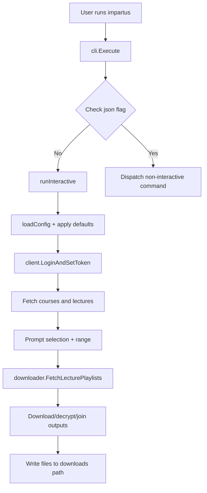
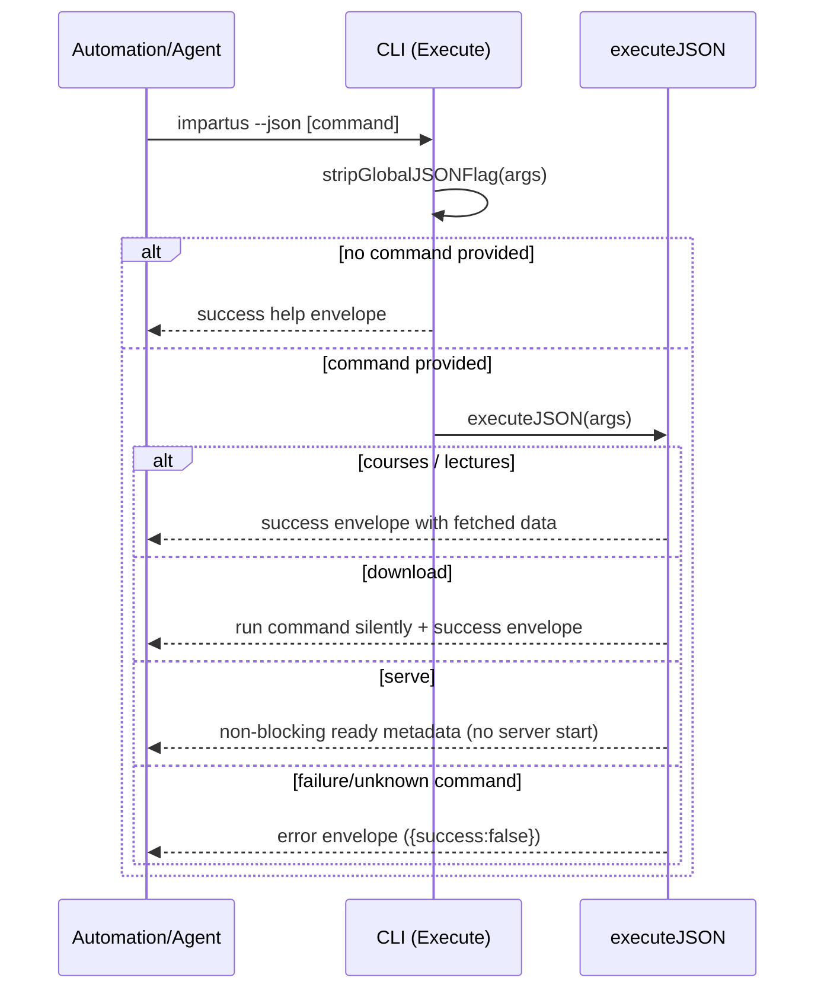
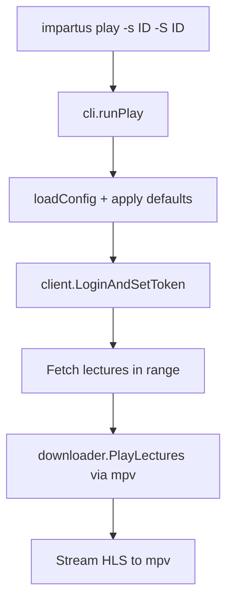
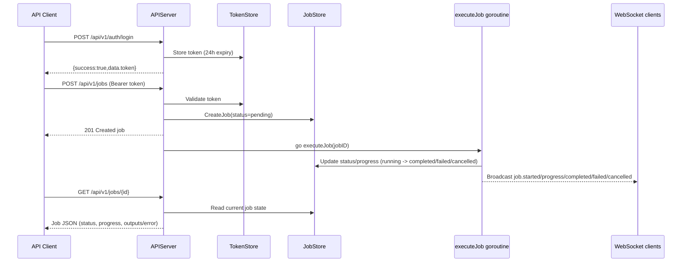
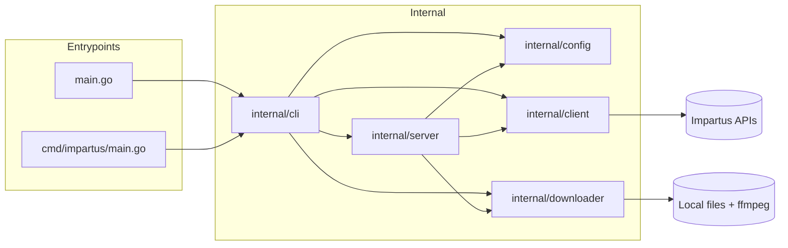

<!-- START doctoc generated TOC please keep comment here to allow auto update -->
**Table of Contents**  *generated automatically*

<!---toc start-->

* [Architecture](#architecture)
  * [CLI interactive mode flow](#cli-interactive-mode-flow)
  * [CLI deterministic JSON mode flow](#cli-deterministic-json-mode-flow)
  * [CLI play command flow](#cli-play-command-flow)
  * [API authenticated job lifecycle flow](#api-authenticated-job-lifecycle-flow)
  * [Internal package/module boundaries](#internal-packagemodule-boundaries)

<!---toc end-->
<!-- END doctoc generated TOC please keep comment here to allow auto update -->

# Architecture

This project is CLI-first and API-secondary: the CLI is the primary execution path, and the API is started from `impartus serve` when needed.

## CLI interactive mode flow

The default mode (`impartus` with no command) runs an interactive download workflow.

## CLI deterministic JSON mode flow

Passing `--json` switches command handling to deterministic response envelopes for automation.

The stream boundary is part of the JSON-mode contract. Success writes exactly
one envelope to stdout and writes no progress or warning text; successful
downloads leave stderr empty. Failure returns a non-zero exit status, leaves
stdout empty, and writes exactly one error envelope to stderr. For download
results, `lectureCount` counts completed lectures, while `outputPaths` may hold
multiple files for each lecture.

## CLI play command flow

The `play` command streams lectures directly in **mpv** without writing output files or invoking FFmpeg join.

Requires **mpv** on `PATH`. Supports the same `--start`/`--end` range flags as download (1-based inclusive).

## API authenticated job lifecycle flow

The API lifecycle is token-gated and executes downloads asynchronously in background jobs.

**Upstream token cache:** When handling `/courses`, `/lectures`, and job execution, `APIServer` caches the authenticated Impartus HTTP client and upstream token for approximately **23 hours** (tokens are typically valid for 24h). This avoids re-login on every API request while still refreshing expired entries.

## Internal package/module boundaries

Core boundaries keep command orchestration in `internal/cli`, network access in `internal/client`, media pipeline in `internal/downloader`, and HTTP orchestration in `internal/server`.

