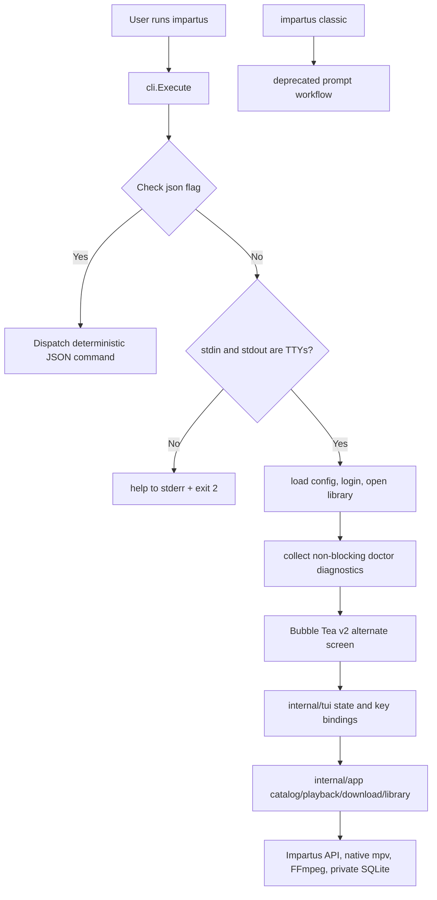
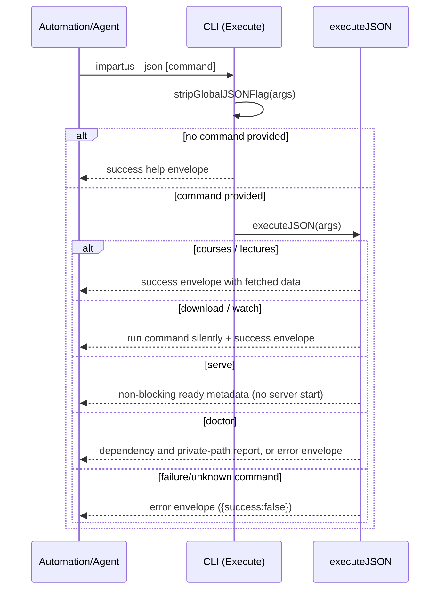
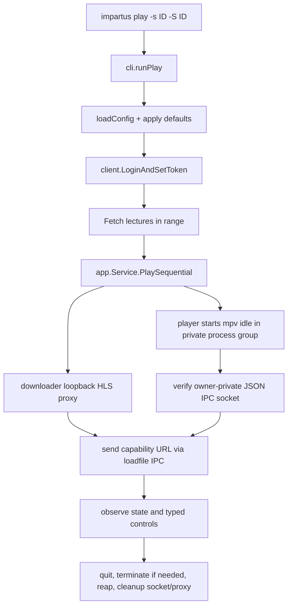
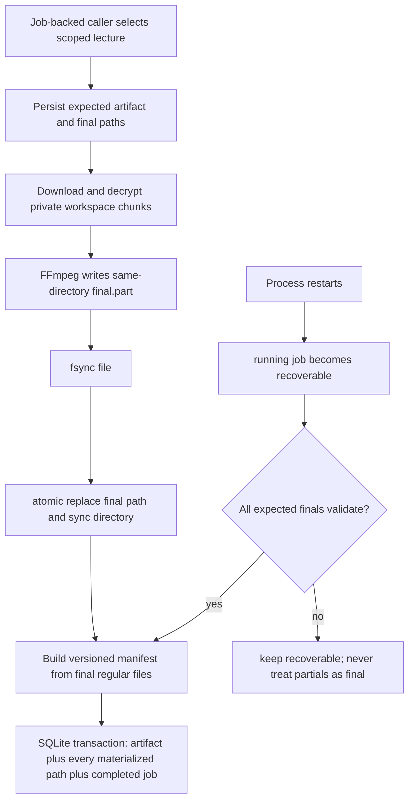
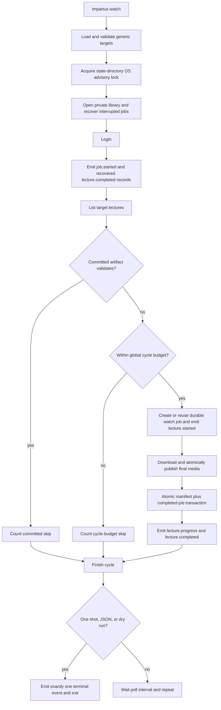
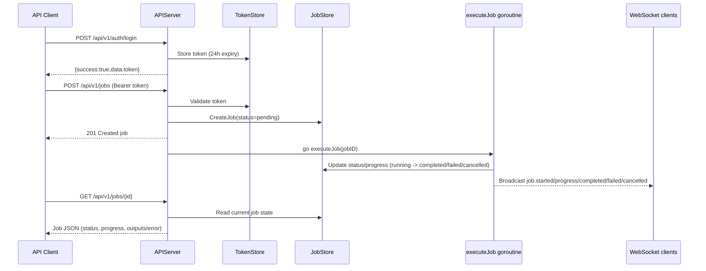
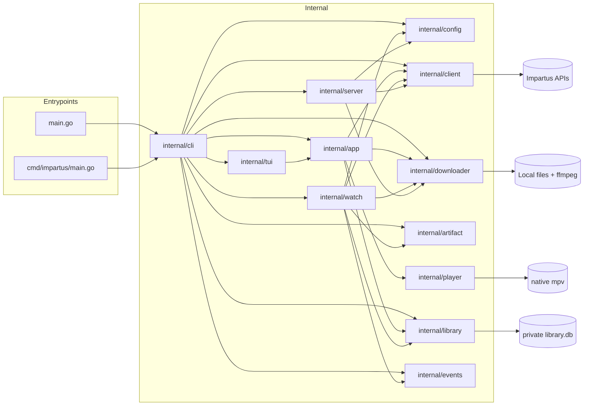

<!-- START doctoc generated TOC please keep comment here to allow auto update -->
**Table of Contents**  *generated automatically*

<!---toc start-->

* [Architecture](#architecture)
  * [TUI and classic interactive flow](#tui-and-classic-interactive-flow)
  * [CLI deterministic JSON mode flow](#cli-deterministic-json-mode-flow)
  * [CLI play command flow](#cli-play-command-flow)
  * [Local library and recovery flow](#local-library-and-recovery-flow)
  * [Generic watcher flow](#generic-watcher-flow)
  * [API authenticated job lifecycle flow](#api-authenticated-job-lifecycle-flow)
  * [Internal package/module boundaries](#internal-packagemodule-boundaries)

<!---toc end-->
<!-- END doctoc generated TOC please keep comment here to allow auto update -->

# Architecture

This project is CLI-first and API-secondary: the CLI is the primary execution path, and the API is started from `impartus serve` when needed.

## TUI and classic interactive flow

The default mode launches `impartus tui` only when stdin and stdout are real
terminals. A non-TTY no-argument invocation prints help to stderr and exits 2.
`impartus classic` preserves the previous prompt-based download workflow for one
release and always prints a deprecation notice.

```mermaid
flowchart TD
  A[User runs impartus] --> B[cli.Execute]
  B --> C{Check json flag}
  C -- Yes --> L[Dispatch deterministic JSON command]
  C -- No --> D{stdin and stdout are TTYs?}
  D -- No --> E[help to stderr + exit 2]
  D -- Yes --> F[load config, login, open library]
  F --> G[collect non-blocking doctor diagnostics]
  G --> H[Bubble Tea v2 alternate screen]
  H --> I[internal/tui state and key bindings]
  I --> J[internal/app catalog/playback/download/library]
  J --> K[Impartus API, native mpv, FFmpeg, private SQLite]
  M[impartus classic] --> N[deprecated prompt workflow]
```

`internal/tui` owns only view state, responsive layout, generated help, and
translation between application/player events and Bubble Tea messages. mpv is
started idle with `--no-terminal`, so Bubble Tea remains the sole terminal
owner. PTY tests pin alternate-screen restoration on normal quit, rendered
application error, context cancellation, and recovered panic.

## CLI deterministic JSON mode flow

Passing `--json` switches command handling to deterministic response envelopes for automation.

```mermaid
sequenceDiagram
  participant A as Automation/Agent
  participant C as CLI (Execute)
  participant J as executeJSON

  A->>C: impartus --json [command]
  C->>C: stripGlobalJSONFlag(args)
  alt no command provided
    C-->>A: success help envelope
  else command provided
    C->>J: executeJSON(args)
    alt courses / lectures
      J-->>A: success envelope with fetched data
    else download / watch
      J-->>A: run command silently + success envelope
    else serve
      J-->>A: non-blocking ready metadata (no server start)
    else doctor
      J-->>A: dependency and private-path report, or error envelope
    else failure/unknown command
      J-->>A: error envelope ({success:false})
    end
  end
```

The stream boundary is part of the JSON-mode contract. Success writes exactly
one envelope to stdout and writes no progress or warning text; successful
downloads leave stderr empty. Failure returns a non-zero exit status, leaves
stdout empty, and writes exactly one error envelope to stderr. For download
results, `lectureCount` counts completed lectures, while `outputPaths` may hold
multiple files for each lecture. `artifacts` contains one stable version-1
manifest per completed lecture; the older fields retain their meaning.
`libraryRecorded` is additive. A post-download SQLite failure leaves the media
and manifest successful, sets it to `false`, and adds one structured
`meta.warnings` entry. Watch JSON mode runs exactly one polling cycle and reports
the cycle result through the same single-envelope boundary.
Failed `doctor` envelopes retain the complete check report in `data` so JSON
automation receives the same diagnostic detail as human mode.

## CLI play command flow

The `play` command streams lectures directly in **mpv** without writing output files or invoking FFmpeg join. Supervised JSON IPC is the default; the old blocking launch is available only through explicit `--mpv-mode=legacy` compatibility mode.

```mermaid
flowchart TD
  A[impartus play -s ID -S ID] --> B[cli.runPlay]
  B --> C[loadConfig + apply defaults]
  C --> D[client.LoginAndSetToken]
  D --> E[Fetch lectures in range]
  E --> F[app.Service.PlaySequential]
  F --> G[downloader loopback HLS proxy]
  F --> H[player starts mpv idle in private process group]
  H --> I[verify owner-private JSON IPC socket]
  G --> J[send capability URL via loadfile IPC]
  I --> J
  J --> K[observe state and typed controls]
  K --> L[quit, terminate if needed, reap, cleanup socket/proxy]
```

Requires **mpv** on `PATH`. Supports the same `--start`/`--end` range flags as download (1-based inclusive). The capability-bearing proxy URL never enters mpv argv: mpv starts with `--no-config`, `--load-scripts=no`, and `--no-terminal`, then receives the URL only after IPC verification. Unix supervision uses a distinct verified process group so cancellation can reap mpv without signalling the caller's group. The loopback proxy enforces its exact Host and tokenized routes and maps upstream 401/403 responses to an actionable authorization failure.

The bounded IPC reader rejects frames larger than 1 MiB. Its synchronous,
non-blocking session handler records completion before a following EOF can
close the client, while forwarding a drop-oldest copy of property and lifecycle
events to the TUI. `WaitForEnd` and the UI therefore never race for the same
terminal event or for disconnect ordering.

`impartus doctor` checks mpv and FFmpeg resolution, private `config.json` and
`.token` permissions, the writable state directory, and the private IPC runtime
without starting mpv. The state check prepares the application library directory
with mode `0700`; the runtime probe reserves and removes an IPC path. It also
opens the library through its normal migration/WAL path and stops on
incompatibility or corruption rather than modifying data through an automatic
repair.

## Local library and recovery flow

```mermaid
flowchart TD
  A[Job-backed caller selects scoped lecture] --> B[Persist expected artifact and final paths]
  B --> C[Download and decrypt private workspace chunks]
  C --> D[FFmpeg writes same-directory final.part]
  D --> E[fsync file]
  E --> F[atomic replace final path and sync directory]
  F --> G[Build versioned manifest from final regular files]
  G --> H[SQLite transaction: artifact plus every materialized path plus completed job]

  I[Process restarts] --> J[running job becomes recoverable]
  J --> K{All expected finals validate?}
  K -- yes --> G
  K -- no --> L[keep recoverable; never treat partials as final]
```

The private database is `$XDG_STATE_HOME/impartus/library.db`. Unix requires a
`0700` parent and `0600` file. Windows creates a protected DACL limited to the
current user, SYSTEM, and Administrators and rejects broader existing ACLs,
while still rejecting symlinks and non-regular database paths.
`modernc.org/sqlite` keeps the build CGO-free. WAL, foreign keys,
`synchronous=FULL`, a busy timeout, and transactional `user_version`
migrations are enforced whenever the writable store opens. A newer schema
fails before journal mode or tables are changed.

`artifacts` holds immutable logical identity plus the latest manifest;
`artifact_files` retains every distinct materialized path and its presence/hash
state; `playback` holds coalesced resume checkpoints; and `jobs` holds expected
outputs and lifecycle state. Default verification checks type and size; only
`--hash` fills or rechecks SHA-256. Verification updates rows but never deletes
media or history. One-shot CLI downloads record completed manifests best-effort
without creating local job rows. The generic watcher creates and starts a local
`watch` job before media publication, then commits its manifest and completed job
atomically only after every expected final file validates. Startup recovery runs
while the watcher owns its OS advisory lock and before login or other network
work. The HTTP API server's existing `.jobs.json` store remains a separate
compatibility surface.

## Generic watcher flow

```mermaid
flowchart TD
  A[impartus watch] --> B[Load and validate generic targets]
  B --> C[Acquire state-directory OS advisory lock]
  C --> D[Open private library and recover interrupted jobs]
  D --> E[Login]
  E --> R[Emit job.started and recovered lecture.completed records]
  R --> S[List target lectures]
  S --> F{Committed artifact validates?}
  F -- yes --> G[Count committed skip]
  F -- no --> H{Within global cycle budget?}
  H -- no --> I[Count cycle-budget skip]
  H -- yes --> J[Create or reuse durable watch job and emit lecture.started]
  J --> K[Download and atomically publish final media]
  K --> L[Atomic manifest plus completed-job transaction]
  L --> M[Emit lecture.progress and lecture.completed]
  G --> N[Finish cycle]
  I --> N
  M --> N
  N --> O{One shot, JSON, or dry run?}
  O -- yes --> P[Emit exactly one terminal event and exit]
  O -- no --> Q[Wait poll interval and repeat]
```

The watcher is deliberately provider-neutral. It owns Impartus discovery and
the durable local artifact boundary, but has no NotebookLM credentials, upload
logic, source identifiers, or deletion policy. `download --events` and
`watch --events` expose the same synchronous version-1 NDJSON lifecycle
contract for independent local consumers.

## API authenticated job lifecycle flow

The API lifecycle is token-gated and executes downloads asynchronously in background jobs.

```mermaid
sequenceDiagram
  participant U as API Client
  participant S as APIServer
  participant T as TokenStore
  participant JS as JobStore
  participant W as executeJob goroutine
  participant WS as WebSocket clients

  U->>S: POST /api/v1/auth/login
  S->>T: Store token (24h expiry)
  S-->>U: {success:true,data.token}
  U->>S: POST /api/v1/jobs (Bearer token)
  S->>T: Validate token
  S->>JS: CreateJob(status=pending)
  S-->>U: 201 Created job
  S->>W: go executeJob(jobID)
  W->>JS: Update status/progress (running -> completed/failed/cancelled)
  W-->>WS: Broadcast job.started/progress/completed/failed/cancelled
  U->>S: GET /api/v1/jobs/{id}
  S->>JS: Read current job state
  S-->>U: Job JSON (status, progress, outputs/error)
```

**Upstream token cache:** When handling `/courses`, `/lectures`, and job execution, `APIServer` caches the authenticated Impartus HTTP client and upstream token for approximately **23 hours** (tokens are typically valid for 24h). This avoids re-login on every API request while still refreshing expired entries.

## Internal package/module boundaries

Core boundaries keep command parsing in `internal/cli`, terminal presentation
and key state in `internal/tui`, shared
catalog/playback orchestration in `internal/app`, mpv ownership and JSON IPC in
`internal/player`, network access in `internal/client`, the media pipeline and
loopback HLS proxy in `internal/downloader`, stable local media contracts in
`internal/artifact`, and HTTP orchestration in `internal/server`.

```mermaid
flowchart LR
  subgraph Entrypoints
    M1[main.go]
    M2[cmd/impartus/main.go]
  end

  subgraph Internal
    CLI[internal/cli]
    TUI[internal/tui]
    CFG[internal/config]
    CLT[internal/client]
    DL[internal/downloader]
    ART[internal/artifact]
    APP[internal/app]
    PLR[internal/player]
    LIB[internal/library]
    EVT[internal/events]
    WATCH[internal/watch]
    SRV[internal/server]
  end

  IMP[(Impartus APIs)]
  FS[(Local files + ffmpeg)]
  MPV[(native mpv)]
  DB[(private library.db)]

  M1 --> CLI
  M2 --> CLI
  CLI --> CFG
  CLI --> CLT
  CLI --> DL
  CLI --> ART
  CLI --> APP
  CLI --> TUI
  CLI --> LIB
  CLI --> EVT
  CLI --> WATCH
  CLI --> SRV
  APP --> CLT
  APP --> DL
  APP --> PLR
  APP --> LIB
  TUI --> APP
  WATCH --> CFG
  WATCH --> CLT
  WATCH --> DL
  WATCH --> ART
  WATCH --> EVT
  WATCH --> LIB
  SRV --> CFG
  SRV --> CLT
  SRV --> DL
  CLT --> IMP
  DL --> FS
  PLR --> MPV
  LIB --> DB
```
