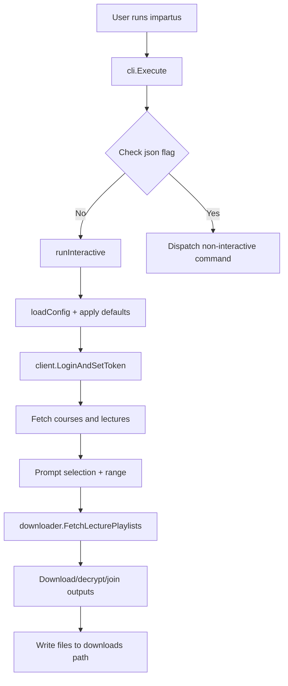
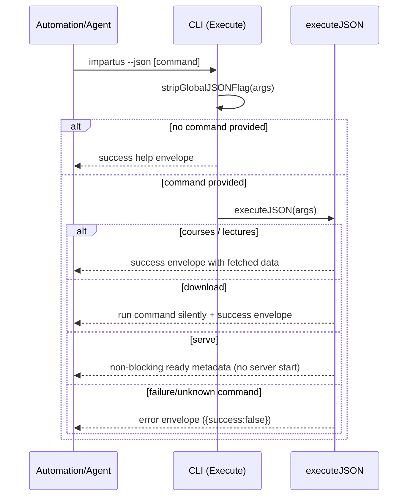
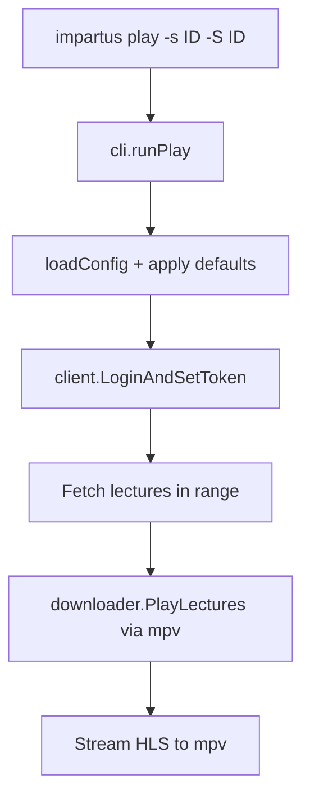
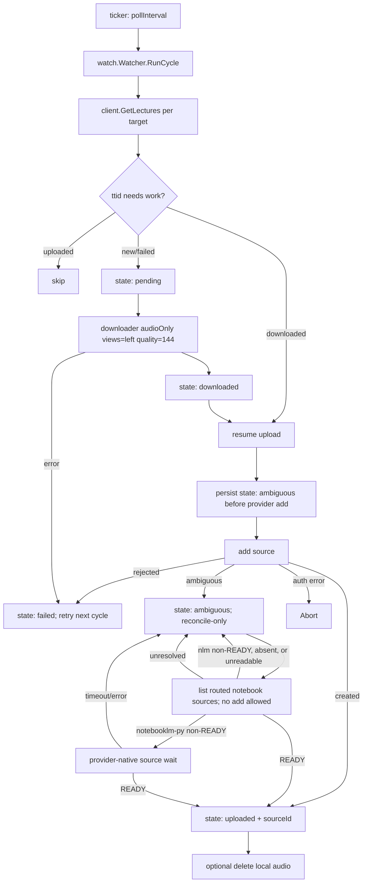
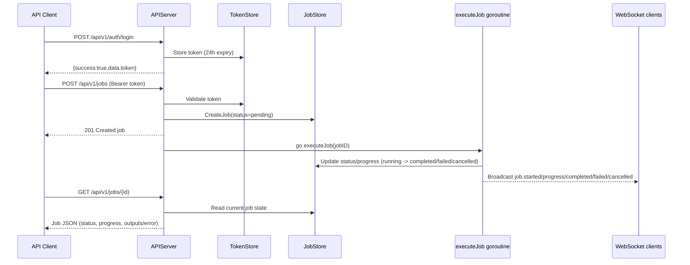
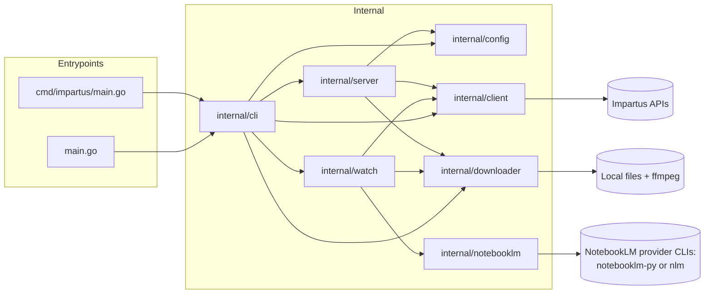

<!-- START doctoc generated TOC please keep comment here to allow auto update -->
**Table of Contents**  *generated automatically*

<!---toc start-->

* [Architecture](#architecture)
  * [CLI interactive mode flow](#cli-interactive-mode-flow)
  * [CLI deterministic JSON mode flow](#cli-deterministic-json-mode-flow)
  * [CLI play command flow](#cli-play-command-flow)
  * [CLI watch command flow](#cli-watch-command-flow)
  * [API authenticated job lifecycle flow](#api-authenticated-job-lifecycle-flow)
  * [Internal package/module boundaries](#internal-packagemodule-boundaries)

<!---toc end-->
<!-- END doctoc generated TOC please keep comment here to allow auto update -->

# Architecture

This project is CLI-first and API-secondary: the CLI is the primary execution path, and the API is started from `impartus serve` when needed.

## CLI interactive mode flow

The default mode (`impartus` with no command) runs an interactive download workflow.

```mermaid
flowchart TD
  A[User runs impartus] --> B[cli.Execute]
  B --> C{Check json flag}
  C -- No --> D[runInteractive]
  D --> E[loadConfig + apply defaults]
  E --> F[client.LoginAndSetToken]
  F --> G[Fetch courses and lectures]
  G --> H[Prompt selection + range]
  H --> I[downloader.FetchLecturePlaylists]
  I --> J[Download/decrypt/join outputs]
  J --> K[Write files to downloads path]
  C -- Yes --> L[Dispatch non-interactive command]
```

## CLI deterministic JSON mode flow

Passing `--json` switches command handling to deterministic response envelopes for automation.

```mermaid
sequenceDiagram
  participant A as Automation/Agent
  participant C as CLI (Execute)
  participant J as executeJSON

  A->>C: impartus --json [command]
  C->>C: stripGlobalJSONFlag(args)
  alt no command provided
    C-->>A: success help envelope
  else command provided
    C->>J: executeJSON(args)
    alt courses / lectures
      J-->>A: success envelope with fetched data
    else download
      J-->>A: run command silently + success envelope
    else serve
      J-->>A: non-blocking ready metadata (no server start)
    else failure/unknown command
      J-->>A: error envelope ({success:false})
    end
  end
```

The stream boundary is part of the JSON-mode contract. Success writes exactly
one envelope to stdout and writes no progress or warning text; successful
downloads leave stderr empty. Failure returns a non-zero exit status, leaves
stdout empty, and writes exactly one error envelope to stderr. For download
results, `lectureCount` counts completed lectures, while `outputPaths` may hold
multiple files for each lecture.

## CLI play command flow

The `play` command streams lectures directly in **mpv** without writing output files or invoking FFmpeg join.

```mermaid
flowchart TD
  A[impartus play -s ID -S ID] --> B[cli.runPlay]
  B --> C[loadConfig + apply defaults]
  C --> D[client.LoginAndSetToken]
  D --> E[Fetch lectures in range]
  E --> F[downloader.PlayLectures via mpv]
  F --> G[Stream HLS to mpv]
```

Requires **mpv** on `PATH`. Supports the same `--start`/`--end` range flags as download (1-based inclusive).

## CLI watch command flow

The `watch` command polls one or more Impartus targets, downloads left-view audio at quality `144`, and optionally uploads each file to NotebookLM via a pluggable CLI provider (`notebooklm-py` or `nlm`).

```mermaid
flowchart TD
  Tick["ticker: pollInterval"] --> Loop
  Loop["watch.Watcher.RunCycle"] --> Fetch["client.GetLectures per target"]
  Fetch --> Diff{"ttid needs work?"}
  Diff -->|uploaded| Skip["skip"]
  Diff -->|downloaded| Up["resume upload"]
  Diff -->|new/failed| Claim["state: pending"]
  Claim --> DL["downloader audioOnly views=left quality=144"]
  DL --> Mark1["state: downloaded"]
  Mark1 --> Up
  Up --> Intent["persist state: ambiguous before provider add"]
  Intent --> Add["add source"]
  Add -->|created| Mark2["state: uploaded + sourceId"]
  Add -->|rejected| Retry["state: failed; retry next cycle"]
  Add -->|ambiguous| Hold["state: ambiguous; reconcile-only"]
  Hold --> SafeRecon["list routed notebook sources; no add allowed"]
  SafeRecon -->|READY| Mark2
  SafeRecon -->|notebooklm-py non-READY| Wait["provider-native source wait"]
  Wait -->|READY| Mark2
  Wait -->|timeout/error| Hold
  SafeRecon -->|nlm non-READY, absent, or unreadable| Hold
  SafeRecon -->|unresolved| Hold
  Mark2 --> Clean["optional delete local audio"]
  DL -->|error| Retry
  Add -->|auth error| Abort
```

Authentication is out-of-band; see [`notebooklm-auth.md`](notebooklm-auth.md). Provider subprocesses receive an allowlisted environment, never Impartus credentials or unrelated application tokens. Before an idempotent add, watch persists `ambiguous` plus a deterministic title/filename token. A failed or interrupted add can therefore only list and reconcile that token, never add again.

READY is required only during ambiguous recovery. `notebooklm-py` delegates non-READY polling to its native `source wait`; `nlm` remains ambiguous until a later list reports READY. Normal exit-0 adds do not wait because the provider has already finalized the uploaded bytes. Unresolved uploads remain reconciliation-only on later polls until READY is observed; these read-only probes do not consume the new-lecture budget, prevent later targets from running after the probe completes, or issue another add. The local audio and ambiguous state remain durable throughout. Definite pre-provider failures become `failed`; persistence failures still stop rather than weakening the duplicate-prevention guarantee.

## API authenticated job lifecycle flow

The API lifecycle is token-gated and executes downloads asynchronously in background jobs.

```mermaid
sequenceDiagram
  participant U as API Client
  participant S as APIServer
  participant T as TokenStore
  participant JS as JobStore
  participant W as executeJob goroutine
  participant WS as WebSocket clients

  U->>S: POST /api/v1/auth/login
  S->>T: Store token (24h expiry)
  S-->>U: {success:true,data.token}
  U->>S: POST /api/v1/jobs (Bearer token)
  S->>T: Validate token
  S->>JS: CreateJob(status=pending)
  S-->>U: 201 Created job
  S->>W: go executeJob(jobID)
  W->>JS: Update status/progress (running -> completed/failed/cancelled)
  W-->>WS: Broadcast job.started/progress/completed/failed/cancelled
  U->>S: GET /api/v1/jobs/{id}
  S->>JS: Read current job state
  S-->>U: Job JSON (status, progress, outputs/error)
```

**Upstream token cache:** When handling `/courses`, `/lectures`, and job execution, `APIServer` caches the authenticated Impartus HTTP client and upstream token for approximately **23 hours** (tokens are typically valid for 24h). This avoids re-login on every API request while still refreshing expired entries.

## Internal package/module boundaries

Core boundaries keep command orchestration in `internal/cli`, network access in `internal/client`, media pipeline in `internal/downloader`, and HTTP orchestration in `internal/server`.

```mermaid
flowchart LR
  subgraph Entrypoints
    M1[main.go]
    M2[cmd/impartus/main.go]
  end

  subgraph Internal
    CLI[internal/cli]
    CFG[internal/config]
    CLT[internal/client]
    DL[internal/downloader]
    WAT[internal/watch]
    NLM[internal/notebooklm]
    SRV[internal/server]
  end

  IMP[(Impartus APIs)]
  FS[(Local files + ffmpeg)]
  NLMCLI[(NotebookLM provider CLIs:<br/>notebooklm-py or nlm)]

  M1 --> CLI
  M2 --> CLI
  CLI --> CFG
  CLI --> CLT
  CLI --> DL
  CLI --> WAT
  CLI --> SRV
  WAT --> CLT
  WAT --> DL
  WAT --> NLM
  NLM --> NLMCLI
  SRV --> CFG
  SRV --> CLT
  SRV --> DL
  CLT --> IMP
  DL --> FS
```
