# Component Deep-Dive Documentation

This document provides detailed technical documentation for each major package in the impartus-go codebase.

## Overview Table

| Package | Purpose | Key Files | Dependencies |
|---------|---------|-----------|--------------|
| `internal/config` | Configuration management and validation | `config.go` | Standard library only |
| `internal/client` | HTTP client and API interactions | `client.go`, `http.go`, `types.go`, `streamutils.go` | `internal/config` |
| `internal/downloader` | Video download, decryption, and FFmpeg integration | `downloader.go`, `ffmpeg.go`, `pipeline.go`, `rate_limiter.go`, `progress_tracker.go`, `parser.go` | `internal/config`, `internal/client`, `mpb/v8` |
| `internal/server` | REST API server and WebSocket hub | `server.go`, `auth.go`, `job_runner.go` | `internal/config`, `internal/client`, `internal/downloader`, `gorilla/mux`, `gorilla/websocket` |
| `internal/cli` | Command-line interface and JSON mode | `cli.go` | All internal packages |
| `internal/alerts` | Webhook-based alerting system | `alerts.go` | Standard library only |
| `internal/metrics` | OpenTelemetry metrics instrumentation | `metrics.go` | `go.opentelemetry.io/otel` |
| `internal/sentryhook` | Sentry error tracking integration | `sentryhook.go` | `github.com/getsentry/sentry-go` |
| `internal/logutil` | Log scrubbing and sanitization | `logutil.go` | Standard library only |

---

## internal/config

### Responsibilities

The `config` package handles all configuration management including:
- Loading configuration from JSON files
- Applying environment variable overrides
- Setting sensible defaults
- Validating configuration values

### Key Functions

| Function | Description |
|----------|-------------|
| `Parse(path string)` | Parses JSON configuration file |
| `Load(path string)` | Loads, applies defaults, and validates config |
| `LoadResolved(path string)` | Loads config with environment variable overrides |
| `Get()` | Returns singleton config instance |
| `ApplyDefaults()` | Sets default values for unset fields |
| `Validate()` | Validates all configuration fields |

### Configuration Schema (JSON)

```json
{
  "username": "string (required)",
  "password": "string (required)",
  "baseUrl": "string (required)",
  "quality": "string (144|450|720, default: 144)",
  "views": "string (left|right|both|first|second, default: both)",
  "downloadLocation": "string (default: ./downloads)",
  "tempDirLocation": "string (default: ./temp)",
  "numWorkers": "int (1-50, default: 5)",
  "slides": "bool (default: false)",
  "audioOnly": "bool (default: false)",
  "audioFormat": "string (mp3|m4a|aac|opus, default: mp3)",
  "rateLimit": "float64 (0.1-100, default: 10)",
  "apiRateLimit": "float64 (0.1-20, default: 2)",
  "enableJitter": "bool (default: true)",
  "enablePipeline": "bool (default: false)",
  "downloadWorkersPerLecture": "int (1-10, default: 3)",
  "decryptWorkersPerLecture": "int (1-10, default: 2)",
  "httpTimeout": "string duration (30s-60m, default: 10m)",
  "progressTracking": {
    "enabled": "bool (default: true)",
    "showSpeed": "bool (default: true)",
    "showETA": "bool (default: true)",
    "updateInterval": "string duration (500ms-10s, default: 2s)",
    "speedWindowSize": "int (3-30, default: 10)"
  }
}
```

### Environment Variables

| Variable | Config Field | Description |
|----------|-------------|-------------|
| `IMPARTUS_USERNAME` | `username` | Override username |
| `IMPARTUS_PASSWORD` | `password` | Override password |
| `IMPARTUS_BASE_URL` | `baseUrl` | Override API URL |
| `IMPARTUS_QUALITY` | `quality` | Override quality |
| `IMPARTUS_VIEWS` | `views` | Override views |
| `IMPARTUS_DOWNLOAD_LOCATION` | `downloadLocation` | Override output dir |
| `IMPARTUS_TEMP_DIR` | `tempDirLocation` | Override temp dir |
| `IMPARTUS_AUDIO_ONLY` | `audioOnly` | Override audio mode |
| `IMPARTUS_AUDIO_FORMAT` | `audioFormat` | Override audio format |
| `IMPARTUS_NUM_WORKERS` | `numWorkers` | Override worker count |
| `IMPARTUS_RATE_LIMIT` | `rateLimit` | Override rate limit |
| `IMPARTUS_API_RATE_LIMIT` | `apiRateLimit` | Override API rate limit |
| `IMPARTUS_HTTP_TIMEOUT` | `httpTimeout` | Override HTTP timeout |

### Validation Rules

1. **Required Fields**: `username`, `password`, `baseUrl` must be non-empty
2. **Quality**: Must be one of `144`, `450`, `720`
3. **Views**: Must be one of `first`, `second`, `both`, `left`, `right`
4. **NumWorkers**: Must be between 1 and 50
5. **AudioFormat** (when audioOnly=true): Must be one of `mp3`, `m4a`, `aac`, `opus`
6. **RateLimit**: Must be between 0.1 and 100 requests/second
7. **APIRateLimit**: Must be between 0.1 and 20 requests/second
8. **HTTP Timeout**: Must be between 30s and 60m
9. **DownloadWorkersPerLecture**: Must be between 1 and 10
10. **DecryptWorkersPerLecture**: Must be between 1 and 10

### Key Types

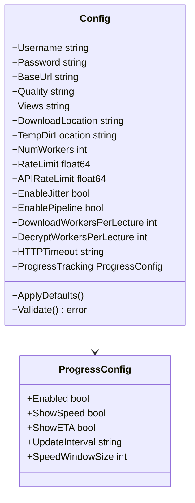

### Dependencies

- Standard library only (`encoding/json`, `fmt`, `os`, `sync`, `time`)
- No external dependencies

### Consumers

- `internal/cli` - Loads initial configuration
- `internal/client` - Uses config for authentication
- `internal/downloader` - Uses config for download settings
- `internal/server` - Uses config for API server settings

---

## internal/client

### Responsibilities

The `client` package handles all HTTP communication with the Impartus API:
- Authentication and token management
- Course and lecture metadata retrieval
- Playlist fetching and parsing
- Stream URL resolution

### Authentication Flow

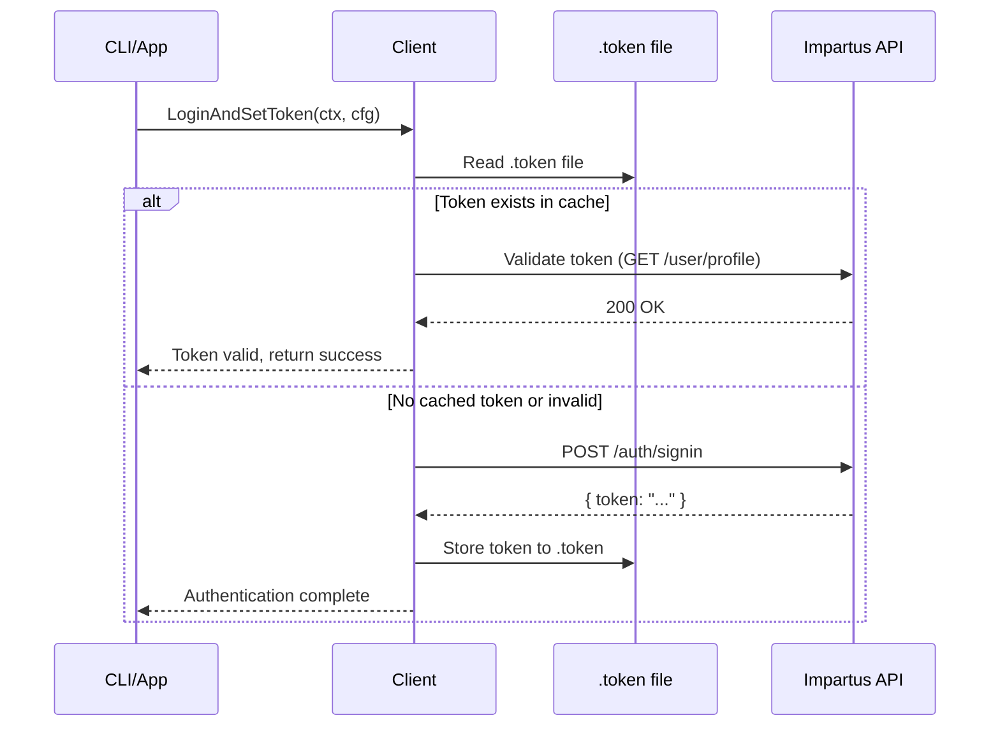

### Key Types

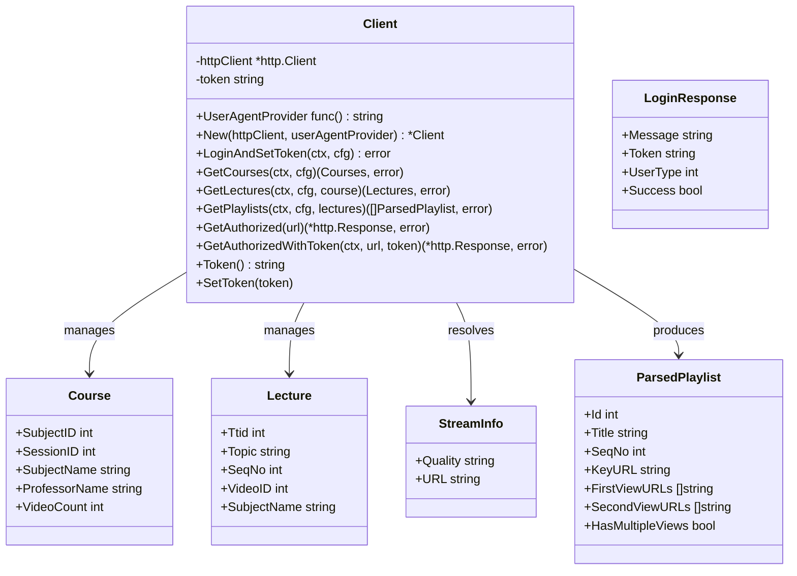

### API Types

| Type | Fields | Description |
|------|--------|-------------|
| `LoginResponse` | `Message`, `Token`, `UserType`, `Success` | Authentication response |
| `Course` | `SubjectID`, `SessionID`, `SubjectName`, `ProfessorName`, `VideoCount` | Course metadata |
| `Lecture` | `Ttid`, `Topic`, `SeqNo`, `VideoID`, `SubjectName` | Individual lecture info |
| `StreamInfo` | `Quality`, `URL` | Available stream qualities |
| `ParsedPlaylist` | `Id`, `Title`, `KeyURL`, `FirstViewURLs`, `SecondViewURLs` | Parsed M3U8 playlist |

### HTTP Client Configuration

```go
func NewHTTPClient(timeout time.Duration) *http.Client {
    return &http.Client{
        Timeout: timeout, // Default: 10 minutes
        Transport: &http.Transport{
            MaxIdleConns:        100,
            MaxIdleConnsPerHost: 10,
            IdleConnTimeout:     90 * time.Second,
            DisableCompression:  false,
        },
    }
}
```

### Dependencies

- `internal/config` - Configuration for auth and URLs
- Standard library: `net/http`, `context`, `encoding/json`, `os`, `regexp`
- No external HTTP libraries

### Consumers

- `internal/cli` - Authentication and course/lecture listing
- `internal/downloader` - Playlist fetching
- `internal/server` - API proxy functionality

---

## internal/downloader

### Responsibilities

The `downloader` package is the core download engine:
- M3U8 playlist parsing
- Chunk downloading with retry logic
- AES-128 CBC decryption
- FFmpeg video/audio processing
- Progress tracking
- Rate limiting

### Download Pipeline

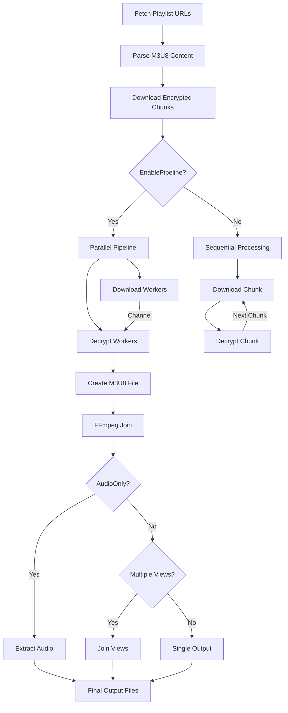

### Key Types

```mermaid
classDiagram
    class Downloader {
        -config *config.Config
        -client *client.Client
        -rateLimiter *RateLimiter
        -maxRetries int
        -ffmpegPath string
        +New(cfg, client) *Downloader
        +FetchLecturePlaylists(ctx, lectures) ([]ParsedPlaylist, error)
        +DownloadPlaylist(ctx, playlist, progress, tracker) (DownloadedPlaylist, error)
        +DownloadAndJoinPlaylist(ctx, playlist, progress, tracker) (JoinResult, error)
        +JoinLectureOutput(file) (JoinResult, error)
    }
    
    class LecturePipeline {
        +config PipelineConfig
        +downloadQueue chan ChunkTask
        +downloadedChunks chan DownloadedChunk
        +decryptedChunks chan DecryptedChunk
        +Start()
        +SubmitDownload(task) error
        +FinishSubmission(totalChunks)
        +Collect() PipelineResult
        +Cancel()
        +GetStats() map[string]interface{}
    }
    
    class RateLimiter {
        -downloadLimiter *rate.Limiter
        -apiLimiter *rate.Limiter
        -jitterEnabled bool
        +WaitForDownload(ctx) error
        +WaitForAPI(ctx) error
    }
    
    class ProgressTracker {
        +totalLectures int32
        +completedLectures int32
        +totalChunks int32
        +completedChunks int32
        +totalBytes int64
        +downloadedBytes int64
        +GetCurrentSpeed() float64
        +GetETA() time.Duration
        +GetOverallProgress() float64
        +Stop()
    }
    
    class ParsedPlaylist {
        +KeyURL string
        +Title string
        +FirstViewURLs []string
        +SecondViewURLs []string
        +ID int
        +SeqNo int
        +HasMultipleViews bool
    }
    
    Downloader --> RateLimiter
    Downloader --> ProgressTracker
    Downloader --> LecturePipeline
    Downloader --> ParsedPlaylist
```

### Rate Limiting Strategy

The `RateLimiter` uses a token bucket algorithm with two separate limiters:

1. **Download Limiter**: Controls chunk download rate (default: 10 req/s)
2. **API Limiter**: Controls API request rate (default: 2 req/s)

Optional jitter adds random delays (±200ms) to avoid thundering herd problems.

```go
func NewRateLimiter(downloadRPS, apiRPS float64, enableJitter bool) *RateLimiter {
    return &RateLimiter{
        downloadLimiter: rate.NewLimiter(rate.Limit(downloadRPS), int(downloadRPS)*2),
        apiLimiter:      rate.NewLimiter(rate.Limit(apiRPS), int(apiRPS)*2),
        jitterEnabled:   enableJitter,
    }
}
```

### AES Decryption

Video chunks are encrypted with AES-128 CBC. The decryption key is obtained from the playlist's `EXT-X-KEY` URI:

```go
func getDecryptionKey(encryptionKey []byte) []byte {
    // Key is obfuscated: first 2 bytes are discarded, rest is reversed
    encryptionKey = encryptionKey[2:]
    for i, j := 0, len(encryptionKey)-1; i < j; i, j = i+1, j-1 {
        encryptionKey[i], encryptionKey[j] = encryptionKey[j], encryptionKey[i]
    }
    return encryptionKey
}
```

### FFmpeg Integration

FFmpeg is used for:
1. **Chunk Concatenation**: Join TS files into MP4/MKV
2. **Audio Extraction**: Extract audio track to MP3/M4A/AAC/Opus
3. **View Merging**: Combine left/right camera views

```go
// Video concatenation
cmd := exec.Command("ffmpeg", "-y", "-hide_banner", 
    "-i", m3u8File, "-c", "copy", outputFile)

// Audio extraction
cmd := exec.Command("ffmpeg", "-y", "-hide_banner",
    "-i", m3u8File, "-vn", "-acodec", codec, "-ab", "192k", outputFile)

// View merging (both cameras)
cmd := exec.Command("ffmpeg", "-y", "-hide_banner",
    "-i", leftFile, "-i", rightFile,
    "-map", "0", "-map", "1", "-c", "copy", outputFile)
```

### Progress Tracking

The `ProgressTracker` provides real-time download statistics:

| Metric | Description |
|--------|-------------|
| `GetCurrentSpeed()` | Current download speed in MB/s |
| `GetETA()` | Estimated time remaining |
| `GetOverallProgress()` | Percentage complete (0-100) |
| `GetStats()` | Returns all metrics as a map |

Speed calculation uses a moving average over configurable window (default: 10 samples).

### Dependencies

- `internal/config` - Configuration settings
- `internal/client` - HTTP client for downloads
- `vbauerster/mpb/v8` - Progress bars
- `golang.org/x/time/rate` - Rate limiting
- Standard library: `crypto/aes`, `crypto/cipher`, `exec`, `io`, `os`

### Consumers

- `internal/cli` - Direct download commands
- `internal/server` - API-driven downloads via job runner

---

## internal/server

### Responsibilities

The `server` package provides a REST API server with:
- JWT-like token authentication
- Course/lecture browsing endpoints
- Async download job management
- WebSocket event broadcasting
- Concurrent job execution

### Route Registry

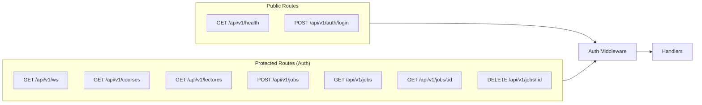

### Key Types

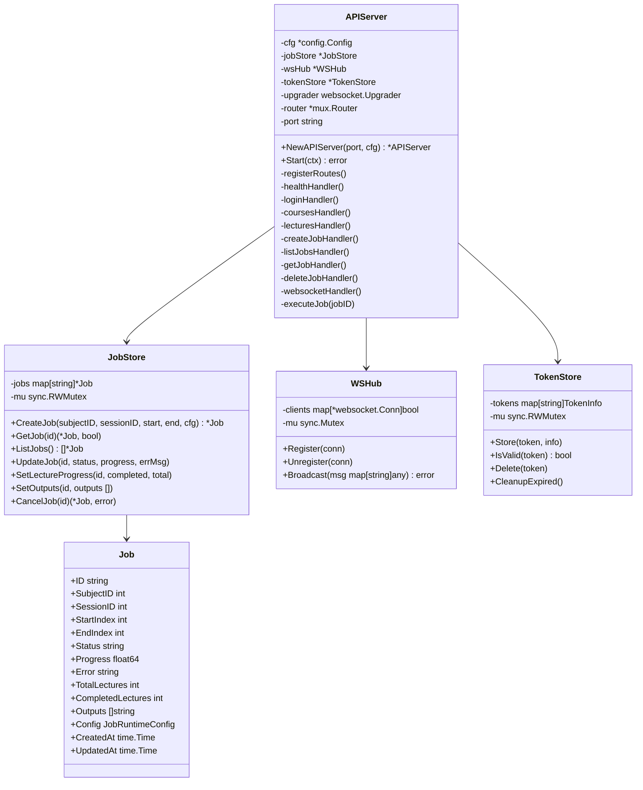

### Authentication Middleware

```go
func (s *APIServer) authMiddleware(next http.Handler) http.Handler {
    return http.HandlerFunc(func(w http.ResponseWriter, r *http.Request) {
        // Skip OPTIONS for CORS preflight
        if r.Method == http.MethodOptions {
            w.WriteHeader(http.StatusOK)
            return
        }

        // Extract Bearer token
        authHeader := r.Header.Get("Authorization")
        if authHeader == "" {
            respondWithError(w, http.StatusUnauthorized, "MISSING_TOKEN", "...")
            return
        }

        token := strings.TrimPrefix(authHeader, "Bearer ")
        if !s.tokenStore.IsValid(token) {
            respondWithError(w, http.StatusUnauthorized, "INVALID_TOKEN", "...")
            return
        }

        next.ServeHTTP(w, r)
    })
}
```

### Job Store

The `JobStore` manages in-memory job state with thread-safe access:

| Method | Purpose |
|--------|---------|
| `CreateJob()` | Create new download job |
| `GetJob()` | Retrieve job by ID |
| `ListJobs()` | List all jobs |
| `UpdateJob()` | Update status/progress |
| `SetLectureProgress()` | Update completed lectures |
| `SetOutputs()` | Store output file paths |
| `CancelJob()` | Cancel running job |

### WebSocket Hub

The `WSHub` enables real-time job progress updates:

```go
type WSHub struct {
    clients map[*websocket.Conn]bool
    mu      sync.Mutex
}

func (h *WSHub) Broadcast(msg map[string]any) error {
    data, _ := json.Marshal(msg)
    for conn := range h.clients {
        conn.WriteMessage(websocket.TextMessage, data)
    }
}
```

### Job Execution Flow

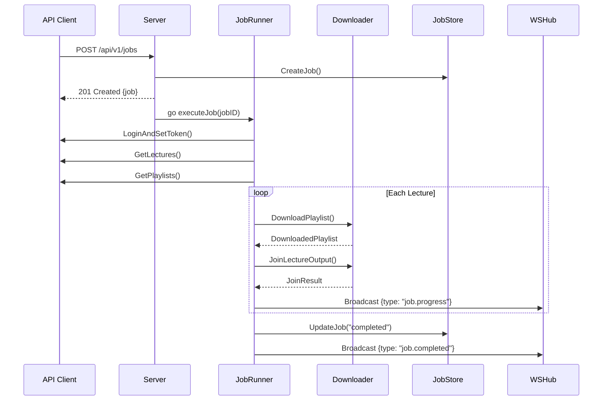

### Dependencies

- `internal/config` - Server configuration
- `internal/client` - Impartus API client
- `internal/downloader` - Download engine
- `github.com/gorilla/mux` - HTTP routing
- `github.com/gorilla/websocket` - WebSocket support
- `github.com/google/uuid` - Request ID generation

### Consumers

- `internal/cli` - Server mode (`impartus serve`)
- External API clients via REST/WebSocket

---

## internal/cli

### Responsibilities

The `cli` package is the command-line interface entry point:
- Command routing and parsing
- Interactive and JSON modes
- Argument validation
- Progress display orchestration

### Command Routing

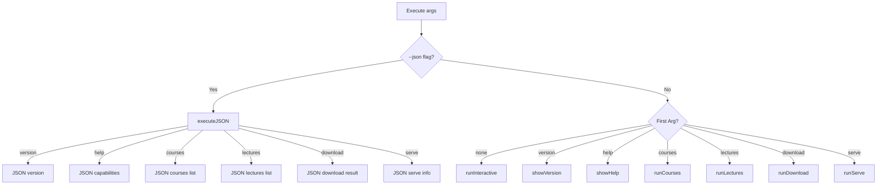

### Key Functions

| Function | Description |
|----------|-------------|
| `Execute(version, date)` | Main entry point |
| `runInteractive()` | Interactive mode with prompts |
| `runCourses(args)` | List courses (CLI or JSON) |
| `runLectures(args)` | List lectures (CLI or JSON) |
| `runDownload(args)` | Download lectures (CLI or JSON) |
| `runServe(args, version)` | Start API server |
| `loadConfig()` | Load and validate configuration |
| `ensureFFmpeg()` | Verify FFmpeg is installed |

### JSON Envelope Format

```json
{
  "success": true,
  "data": { /* response payload */ },
  "error": null,
  "meta": {
    "command": "courses",
    "mode": "json"
  }
}
```

### Flag Parsing

```go
// Download flags
--subject/-s <id>      // Subject ID (required)
--session/-S <id>      // Session ID (required)
--start <n>            // Start lecture index (1-based)
--end <n>              // End lecture index (1-based)
--quality <q>          // Quality override (144|450|720)
--views <v>            // Views override (left|right|both)
--audio-only           // Audio-only mode
--format <fmt>         // Audio format (mp3|m4a|aac|opus)
--output/-o <path>     // Output directory override

// Server flags
--port <port>          // Server port (default: 8080)

// Global flags
--json                 // Enable JSON output mode
```

### Interactive Flow

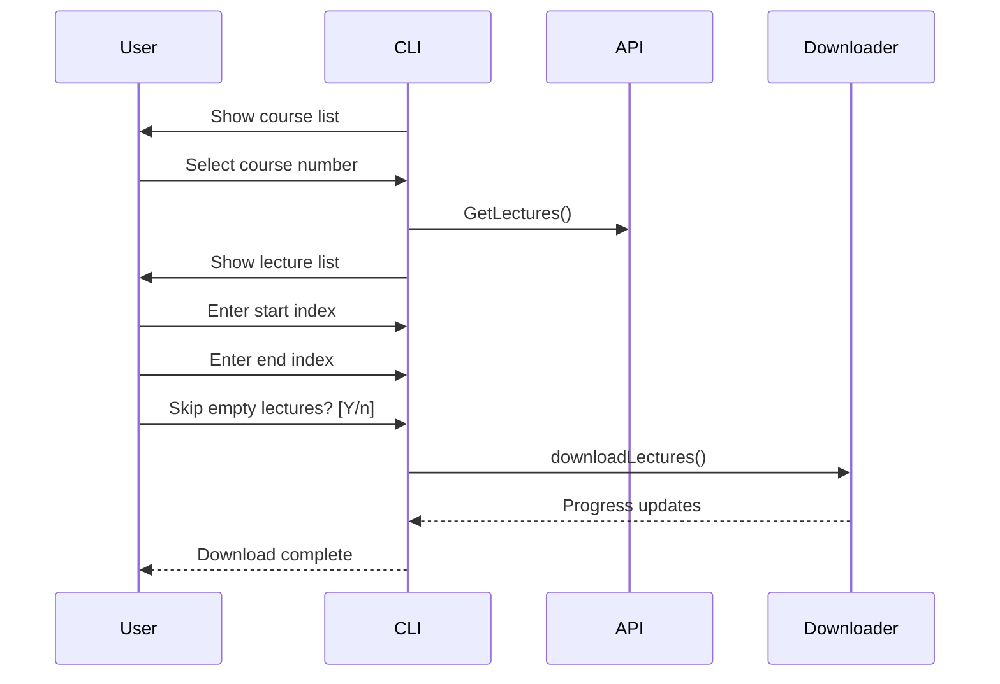

### Key Types

```mermaid
classDiagram
    class jsonEnvelope {
        +Success bool
        +Data interface{}
        +Error *jsonErr
        +Meta jsonMeta
    }
    
    class jsonMeta {
        +Command string
        +Mode string
    }
    
    class capabilityPayload {
        +Name string
        +Description string
        +DefaultMode string
        +Flags []string
        +Commands []capabilityCommand
    }
    
    class downloadResult {
        +Status string
        +OutputPaths []string
        +LectureCount int
    }
    
    jsonEnvelope --> jsonMeta
    jsonEnvelope --> downloadResult : data
```

### Dependencies

- `internal/config` - Configuration loading
- `internal/client` - API client
- `internal/downloader` - Download engine
- `internal/server` - Server mode
- `github.com/vbauerster/mpb/v8` - Progress bars

### Consumers

- `main.go` - Application entry point

---

## internal/alerts

### Responsibilities

The `alerts` package provides configurable alerting:
- Webhook-based notifications
- Slack message formatting
- PagerDuty incident creation
- Rate limiting to prevent spam

### Key Types

```mermaid
classDiagram
    class Alerter {
        -config Config
        -client *http.Client
        -lastAlert map[string]time.Time
        -mu sync.Mutex
        +Init() error
        +Send(ctx, alert) error
        +SendAlert(ctx, severity, title, message, metadata)
        +SendInfo(ctx, title, message)
        +SendWarning(ctx, title, message)
        +SendCritical(ctx, title, message)
    }
    
    class Alert {
        +Timestamp time.Time
        +Severity Severity
        +Title string
        +Message string
        +Source string
        +RequestID string
        +Metadata map[string]interface{}
        +Environment string
    }
    
    class Severity {
        <<enumeration>>
        Info
        Warning
        Critical
    }
    
    class Config {
        +WebhookURL string
        +Enabled bool
        +Environment string
        +RateLimit time.Duration
    }
    
    Alerter --> Config
    Alerter --> Alert
    Alerter --> Severity
```

### Environment Variables

| Variable | Description |
|----------|-------------|
| `ALERT_WEBHOOK_URL` | Webhook endpoint URL |
| `ALERT_ON_ERRORS` | Set to `true` to enable alerts |
| `SENTRY_ENVIRONMENT` | Environment tag (default: development) |
| `PAGERDUTY_ROUTING_KEY` | PagerDuty routing key |

### Webhook Integration

```go
// Slack webhook formatting
func (a *Alerter) formatSlack(alert Alert) map[string]interface{} {
    color := "#36a64f" // green for info
    if alert.Severity == SeverityWarning {
        color = "#ff9900" // orange
    } else if alert.Severity == SeverityCritical {
        color = "#ff0000" // red
    }
    
    return map[string]interface{}{
        "attachments": []map[string]interface{}{{
            "color":     color,
            "title":     alert.Title,
            "text":      alert.Message,
            "timestamp": alert.Timestamp.Unix(),
        }},
    }
}
```

### Usage Example

```go
// Initialize from environment
alerts.Init()

// Send critical alert
alerts.SendCritical(ctx, "Download Failed", "Failed to download lecture 123")

// Send with metadata
alerts.SendAlert(ctx, alerts.SeverityWarning, 
    "Rate Limit", "Approaching rate limit", 
    map[string]interface{}{"requests_per_sec": 9.5})
```

### Dependencies

- Standard library only (`context`, `encoding/json`, `net/http`, `sync`, `time`)
- No external packages

### Consumers

- `internal/server` - Job failure alerts
- `internal/downloader` - Download error alerts

---

## internal/metrics

### Responsibilities

The `metrics` package implements OpenTelemetry instrumentation:
- Download metrics (count, duration, bytes)
- API request metrics (count, latency, errors)
- Job metrics (active, completed, failed)
- Export via OTLP or manual collection

### Key Types

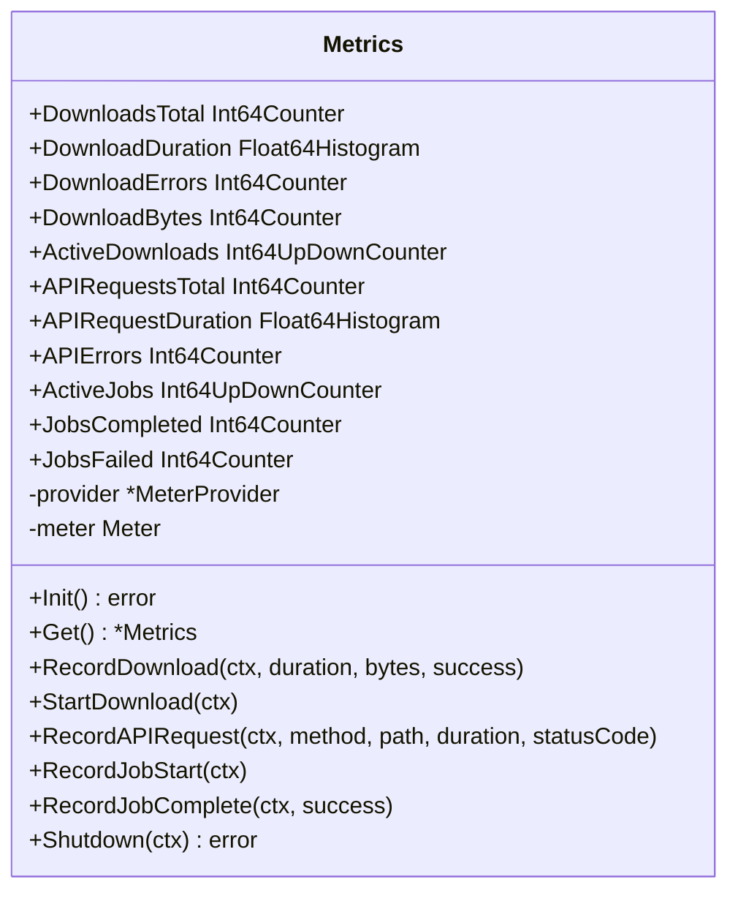

### Metrics Available

| Metric | Type | Unit | Description |
|--------|------|------|-------------|
| `impartus_downloads_total` | Counter | `{download}` | Total downloads |
| `impartus_download_duration_seconds` | Histogram | `s` | Download duration |
| `impartus_download_errors_total` | Counter | `{error}` | Total errors |
| `impartus_download_bytes_total` | Counter | `By` | Total bytes downloaded |
| `impartus_active_downloads` | UpDownCounter | `{download}` | Active downloads |
| `impartus_api_requests_total` | Counter | `{request}` | Total API requests |
| `impartus_api_request_duration_seconds` | Histogram | `s` | API latency |
| `impartus_api_errors_total` | Counter | `{error}` | Total API errors |
| `impartus_active_jobs` | UpDownCounter | `{job}` | Active jobs |
| `impartus_jobs_completed_total` | Counter | `{job}` | Completed jobs |
| `impartus_jobs_failed_total` | Counter | `{job}` | Failed jobs |

### Environment Variables

| Variable | Description |
|----------|-------------|
| `OTEL_EXPORTER_OTLP_ENDPOINT` | OpenTelemetry collector endpoint |

### Usage Example

```go
// Initialize at startup
metrics.Init()

// Start tracking
metrics.Get().StartDownload(ctx)
defer metrics.Get().RecordDownload(ctx, duration, bytes, success)

// Record API call
metrics.Get().RecordAPIRequest(ctx, "GET", "/courses", duration, 200)
```

### Dependencies

- `go.opentelemetry.io/otel` - OpenTelemetry SDK
- `go.opentelemetry.io/otel/exporters/otlp/otlpmetric/otlpmetrichttp` - OTLP exporter
- `go.opentelemetry.io/otel/metric` - Metrics API
- `go.opentelemetry.io/otel/sdk/metric` - SDK implementation

### Consumers

- `internal/server` - Request metrics
- `internal/downloader` - Download metrics

---

## internal/sentryhook

### Responsibilities

The `sentryhook` package provides Sentry integration:
- Error capture with stack traces
- Request context correlation
- User context tracking
- HTTP middleware for panic recovery

### Key Functions

| Function | Description |
|----------|-------------|
| `Init()` | Initialize Sentry SDK from `SENTRY_DSN` |
| `Flush(timeout)` | Send buffered events |
| `SetUser(userID, email)` | Set user context |
| `SetRequestID(requestID)` | Set request correlation |
| `SetTag(key, value)` | Add custom tag |
| `CaptureError(err)` | Report error |
| `CaptureErrorWithContext(err, tags, context)` | Report with context |
| `CaptureMessage(message)` | Report message |
| `IsEnabled()` | Check if Sentry is configured |
| `Middleware(next)` | HTTP middleware for panic recovery |

### Environment Variables

| Variable | Description |
|----------|-------------|
| `SENTRY_DSN` | Sentry DSN (required to enable) |
| `SENTRY_ENVIRONMENT` | Environment tag (default: development) |
| `SENTRY_RELEASE` | Release version (default: impartus-cli@1.0.0) |
| `SENTRY_DEBUG` | Enable debug mode (true/false) |

### HTTP Middleware

```go
func Middleware(next http.Handler) http.Handler {
    return http.HandlerFunc(func(w http.ResponseWriter, r *http.Request) {
        requestID := r.Header.Get("X-Request-ID")
        
        sentry.WithScope(func(scope *sentry.Scope) {
            scope.SetTag("request_id", requestID)
            scope.SetTag("http_method", r.Method)
            scope.SetTag("http_path", r.URL.Path)
            
            defer func() {
                if r := recover(); r != nil {
                    hub.CaptureException(err)
                    sentry.Flush(5 * time.Second)
                    http.Error(w, "Internal Server Error", 500)
                }
            }()
            
            next.ServeHTTP(w, r)
        })
    })
}
```

### Dependencies

- `github.com/getsentry/sentry-go` - Sentry SDK
- Standard library only for rest

### Consumers

- `main.go` - Initialization
- `internal/server` - HTTP middleware

---

## internal/logutil

### Responsibilities

The `logutil` package provides log scrubbing:
- Redact passwords, tokens, API keys
- Redact email addresses (partial)
- Redact URLs containing authentication data
- Sanitize map values

### Pattern Matching

| Pattern | Action |
|---------|--------|
### Key Functions

```go
// Redact sensitive data from string
func RedactSensitive(message string) string

// Format and redact (like fmt.Sprintf)
func RedactSensitivef(format string, args ...interface{}) string

// Redact sensitive keys in map
func SanitizeMap(data map[string]interface{}) map[string]interface{}

// Alias for RedactSensitive
func SanitizeString(s string) string
```

### Usage Example

```go
import "github.com/rabesss/impartus-cli/internal/logutil"

// Safe logging
log.Printf(logutil.RedactSensitivef("Config loaded: %+v", config))

// Safe map logging
safeConfig := logutil.SanitizeMap(configMap)
log.Printf("Config: %+v", safeConfig)
```

### Sensitive Keys

The `SanitizeMap` function redacts these keys (case-insensitive):
- `password`, `passwd`, `pwd`
- `token`, `secret`
- `api_key`, `apikey`
- `authorization`, `auth`

### Dependencies

- Standard library only (`fmt`, `regexp`, `strings`)
- No external packages

### Consumers

- Any package that logs sensitive data
- `internal/config` - Logging loaded configuration
- `internal/server` - Request logging

---

## Architecture Overview

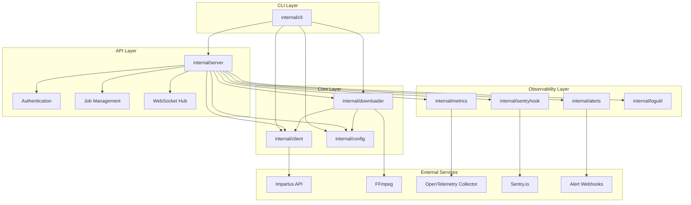

## Data Flow Summary

1. **Configuration**: Loaded by `config` package from JSON file + environment variables
2. **Authentication**: Handled by `client` package, token cached in `.token` file
3. **Course/Lecture Discovery**: Via `client.GetCourses()` and `client.GetLectures()`
4. **Download Pipeline**: 
   - `downloader.FetchLecturePlaylists()` resolves M3U8 URLs
   - `downloader.DownloadPlaylist()` downloads encrypted chunks
   - AES decryption applied inline or via pipeline workers
   - `downloader.JoinLectureOutput()` merges with FFmpeg
5. **Progress Tracking**: Real-time updates via `ProgressTracker` and WebSocket events
6. **Observability**: Metrics to OpenTelemetry, errors to Sentry, alerts to webhooks
