# Dogfood evidence (26 Aug 2026)

Two live runs on the cloud agent [Pstack cli dogfooding](https://cursor.com/agents/bc-01a03c93-2ac2-7097-89bb-3bb80797d748). Binary `impartus` 0.1.28. GitHub issues [#189](https://github.com/rabesss/impartus-cli/issues/189) through [#200](https://github.com/rabesss/impartus-cli/issues/200). Origin at `https://cursor.com/codebase/ravish/impartus-cli/` had no issues API and no login in this environment, so the tracker is GitHub `rabesss/impartus-cli`.

The stacked fix plan is [stacked-prs.md](stacked-prs.md). Execution playbook is `autopilot-stack`. Do not start owners until the operator says go.

## Runs

**Run 1, CLI, no mpv.** Harness `evidence/cli/dogfood_cli.py`. Decision log `evidence/cli/cli-dogfood.tsv`. Findings `evidence/cli/findings.json`. `impartus-ui` was absent. `play` and `tui` reported the missing tools correctly.

**Run 2, TUI and play, mpv 0.37.0.** Adjacent `impartus-ui` from `make build`. XFCE desktop `DISPLAY=:1`. Catalog, diagnostics mpv PASS, self-test 100%, Enter playback, and CLI `impartus play` all worked. The bugs below are the failures around that.

Do not re-run `download --start 0` on a live course. Do not point `IMPARTUS_TOKEN_CACHE` at `/opt/cursor/artifacts`.

## Issue map and stack order

| Issue | Group | Run | Stack id | Depends on |
| --- | --- | --- | --- | --- |
| [#193](https://github.com/rabesss/impartus-cli/issues/193) | B6 | 1 | `PR-token-cache` | none |
| [#189](https://github.com/rabesss/impartus-cli/issues/189) | B1 | 1 | `PR-cli-start` | token-cache |
| [#192](https://github.com/rabesss/impartus-cli/issues/192) | B5 | 1 | `PR-cli-quality` | cli-start |
| [#191](https://github.com/rabesss/impartus-cli/issues/191) | B4 | 1 | `PR-cli-json` | cli-quality |
| [#190](https://github.com/rabesss/impartus-cli/issues/190) | B2+B3 | 1 | `PR-cli-help` | cli-json |
| [#195](https://github.com/rabesss/impartus-cli/issues/195) | B8 | 1 | `PR-library-argv` | cli-help |
| [#194](https://github.com/rabesss/impartus-cli/issues/194) | B7 | 1 | `PR-watch-skip` | library-argv |
| [#196](https://github.com/rabesss/impartus-cli/issues/196) | T1+T5 | 2 | `PR-tui-events` | watch-skip |
| [#197](https://github.com/rabesss/impartus-cli/issues/197) | T2 | 2 | `PR-tui-download-progress` | tui-events |
| [#197](https://github.com/rabesss/impartus-cli/issues/197) | T3 | 2 | `PR-tui-download-cancel` | download-progress |
| [#198](https://github.com/rabesss/impartus-cli/issues/198) | T4+T8 | 2 | `PR-tui-chrome` | download-cancel |
| [#199](https://github.com/rabesss/impartus-cli/issues/199) | T7 | 2 | `PR-tui-nav-focus` | tui-chrome |
| [#200](https://github.com/rabesss/impartus-cli/issues/200) | T6 | 2 | `PR-tui-filter-slash` | tui-nav-focus |

Review-gated (interaction change). `PR-cli-start`, `PR-cli-help`, and every `PR-tui-*`.

Bodies that match the bug template also live under [issues/](issues/).

## Run 1 media (CLI, no mpv)

### B1. `download --start 0` selects the whole course ([#189](https://github.com/rabesss/impartus-cli/issues/189))

`fetchvideo` started. SIGTERM, exit 130.

```
{"success":false,"data":null,"error":{"message":"request failed, host-redacted fetchvideo context canceled"},"meta":{"command":"download","mode":"json"}}
```

Log. [evidence/cli/download_start0.stderr.redacted](evidence/cli/download_start0.stderr.redacted)

### B2+B3. Help ignores `help download` and omits flags ([#190](https://github.com/rabesss/impartus-cli/issues/190))

`download --help` is a description plus `[flags]`. [evidence/cli/download_help.stdout](evidence/cli/download_help.stdout)

`help download --json` is root capabilities. [evidence/cli/help_download_json.stdout.redacted](evidence/cli/help_download_json.stdout.redacted)

Root help lists `--json` only on the `--events` line. [evidence/cli/root_help.stdout](evidence/cli/root_help.stdout)

### B4. `--json` after `--` ([#191](https://github.com/rabesss/impartus-cli/issues/191))

[evidence/cli/json_after_sentinel.stderr](evidence/cli/json_after_sentinel.stderr) is a JSON envelope (`"mode":"json"`) for `download --subject 1 --session 2 -- --json`.

### B5. Invalid `--quality` after login ([#192](https://github.com/rabesss/impartus-cli/issues/192))

[evidence/cli/download_bad_quality.stderr](evidence/cli/download_bad_quality.stderr)

### B6. World-readable token cache ([#193](https://github.com/rabesss/impartus-cli/issues/193))

[evidence/cli/token-modes.txt](evidence/cli/token-modes.txt)

```
600 /tmp/impartus-dogfood/token
666 /opt/cursor/artifacts/cli-dogfood/token-cache
```

### B7. Watch skip double-count ([#194](https://github.com/rabesss/impartus-cli/issues/194))

[evidence/cli/watch_dry_json.stdout.redacted](evidence/cli/watch_dry_json.stdout.redacted)

```
"cycle":{"listed":6,"new":6,"skipped":3,"downloaded":0,"failed":0,"dryRun":true}
```

### B8. `library vrfy` opens the store first ([#195](https://github.com/rabesss/impartus-cli/issues/195))

[evidence/cli/library_unknown.stderr](evidence/cli/library_unknown.stderr) (`unknown library command: vrfy`). The store file is created before that line.

## Run 2 media (TUI + mpv)

What worked. Catalog connected, diagnostics mpv PASS, self-test 100%, lecture playback in mpv, CLI play with classroom video.


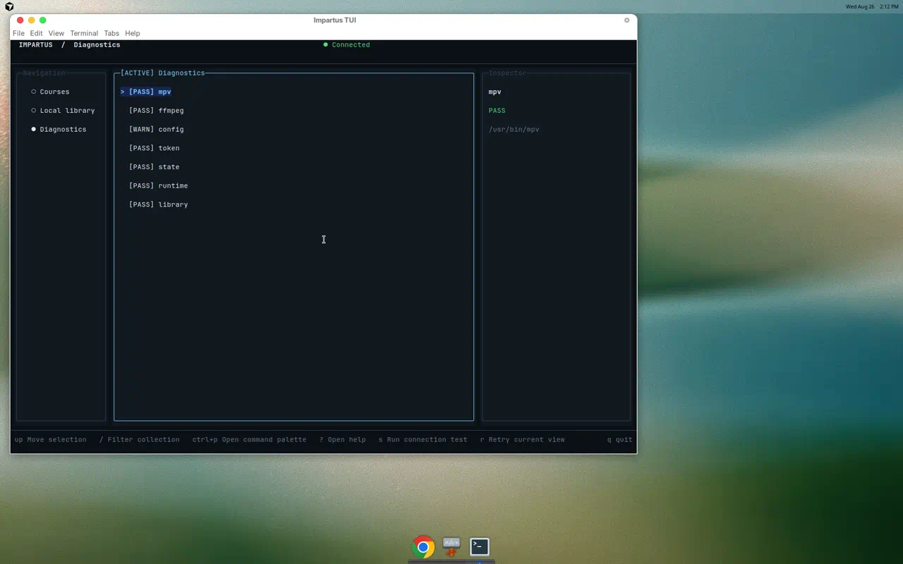

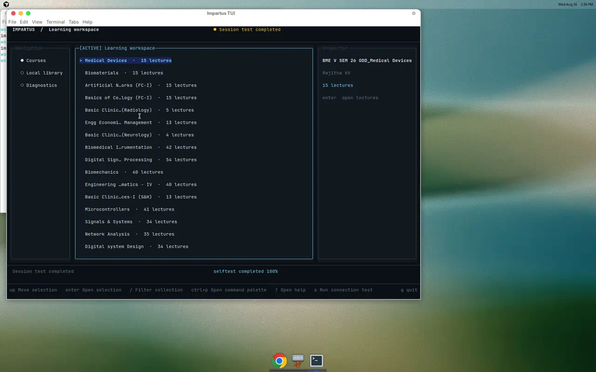

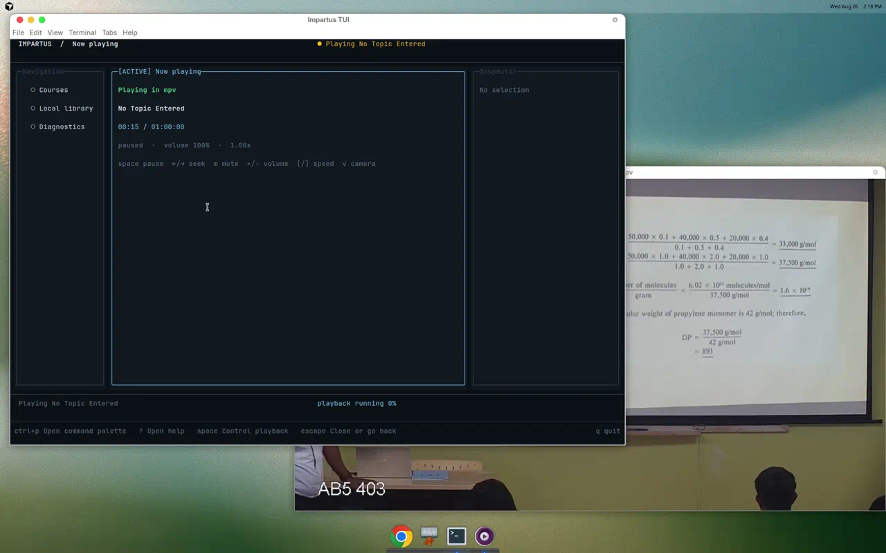

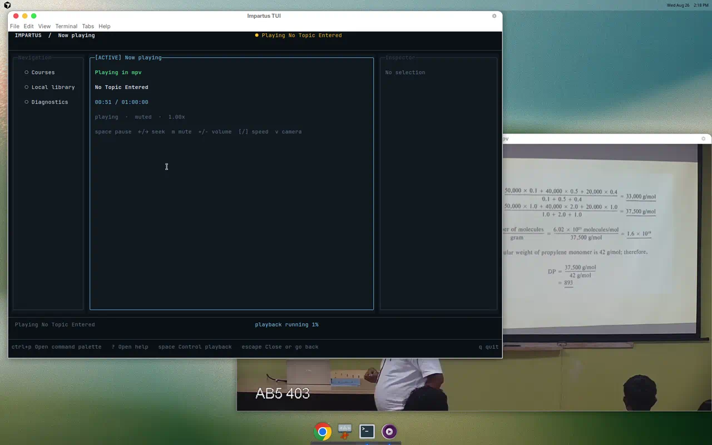

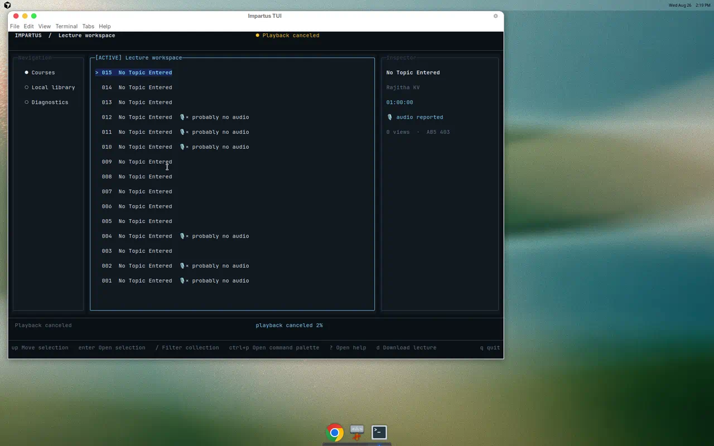

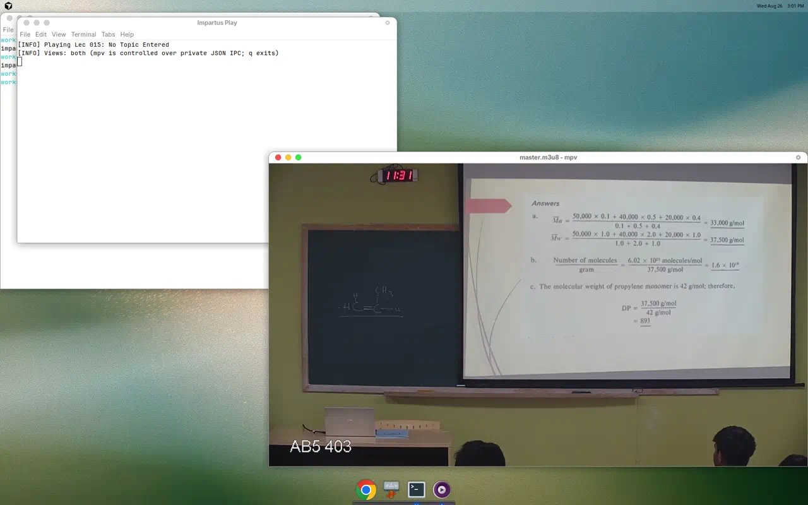

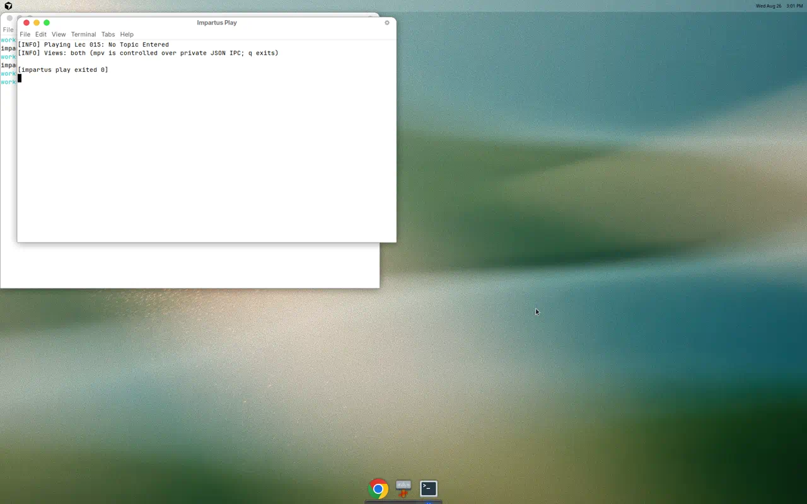

TUI playback video. [evidence/tui/tui_lecture_playback_mpv_controls.mp4](evidence/tui/tui_lecture_playback_mpv_controls.mp4)

CLI play video. [evidence/tui/cli_play_mpv_lecture_video.mp4](evidence/tui/cli_play_mpv_lecture_video.mp4)

### T1+T5. Idle `/events` TimeoutError ([#196](https://github.com/rabesss/impartus-cli/issues/196))

Two sessions. ~5 to 6 minutes. stderr dump (reverted, not shipped).

```
2026-08-26T14:49:06.577Z impartus-ui: terminal frontend failed during interactive renderer
[DOMException [TimeoutError]: The operation timed out.]
2026-08-26T14:57:36.537Z impartus-ui: terminal frontend failed during interactive renderer
[DOMException [TimeoutError]: The operation timed out.]
```

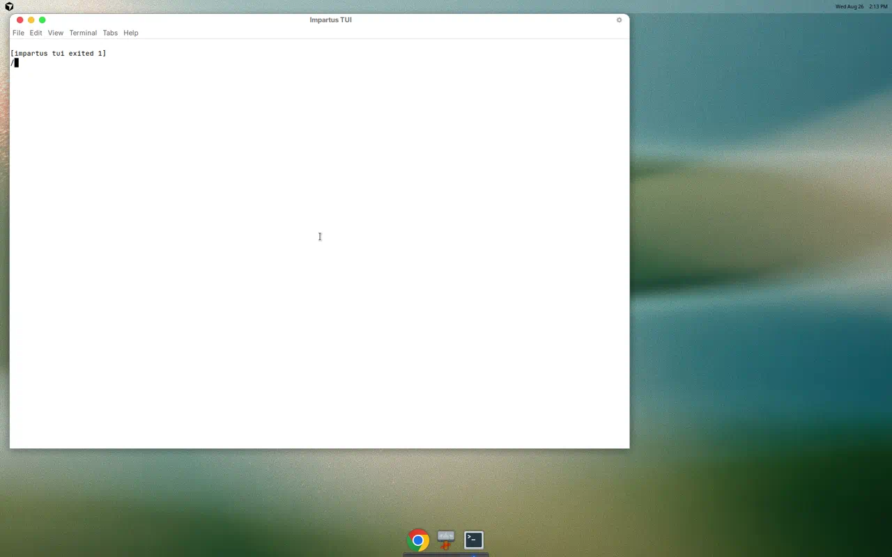

Log. [evidence/tui/tui_timeout_crash.log](evidence/tui/tui_timeout_crash.log)

### T2+T3. Download stuck at 0% and Escape does not cancel ([#197](https://github.com/rabesss/impartus-cli/issues/197))

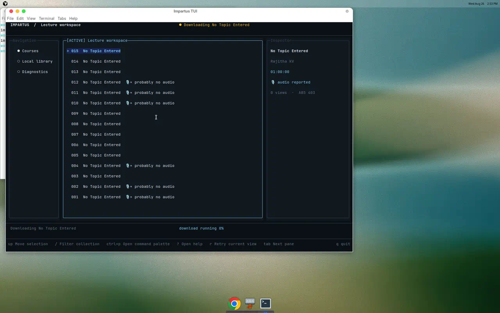

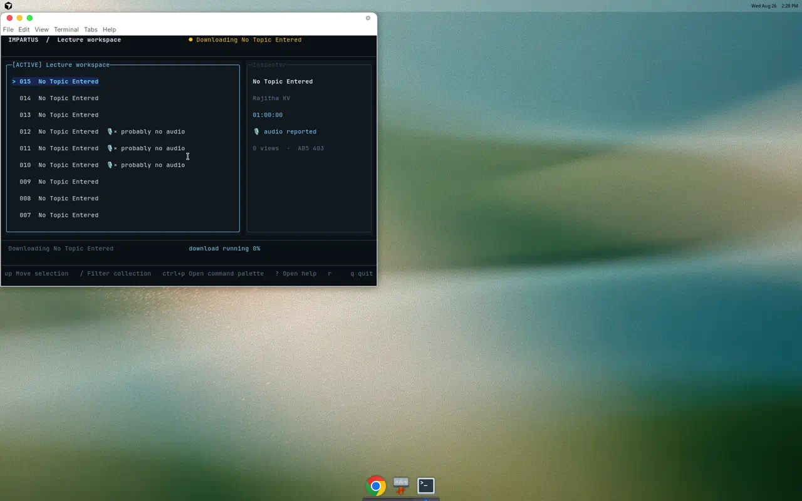

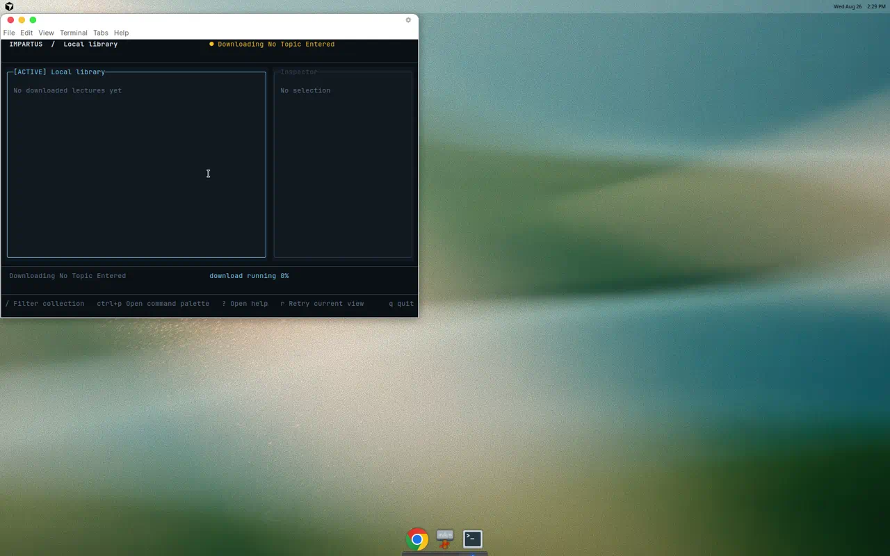

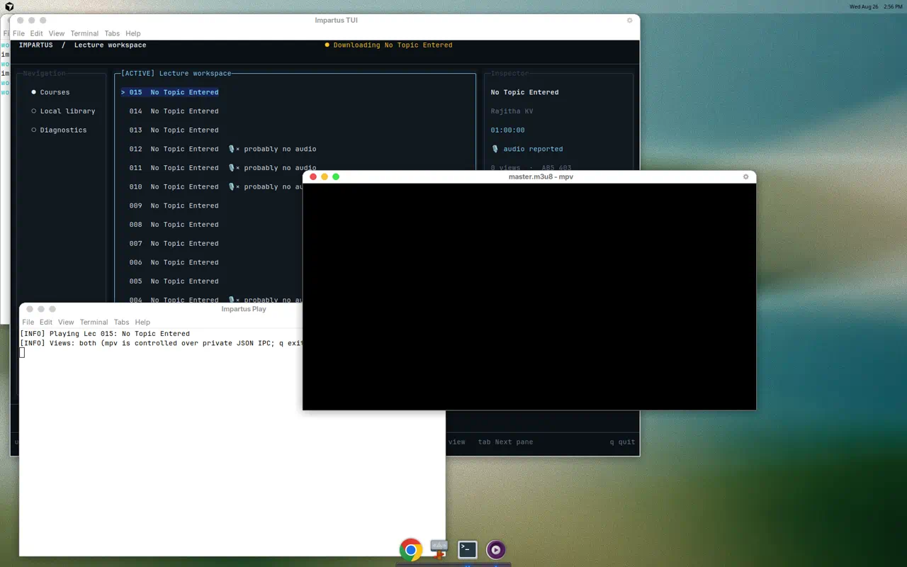

Temp dir at 55s. 32 `.ts` files, 32M. [evidence/tui/tui_download_chunk_progress.log](evidence/tui/tui_download_chunk_progress.log)

### T4+T8. Help and footer hide keys ([#198](https://github.com/rabesss/impartus-cli/issues/198))

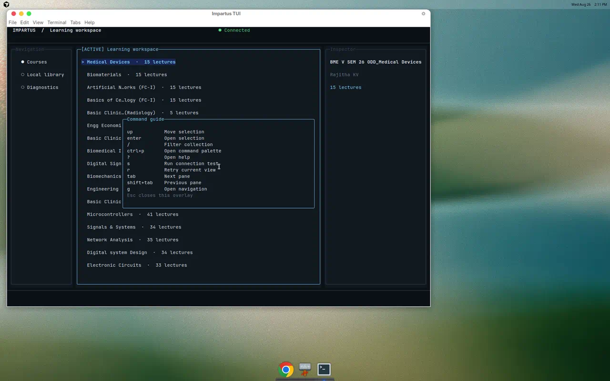


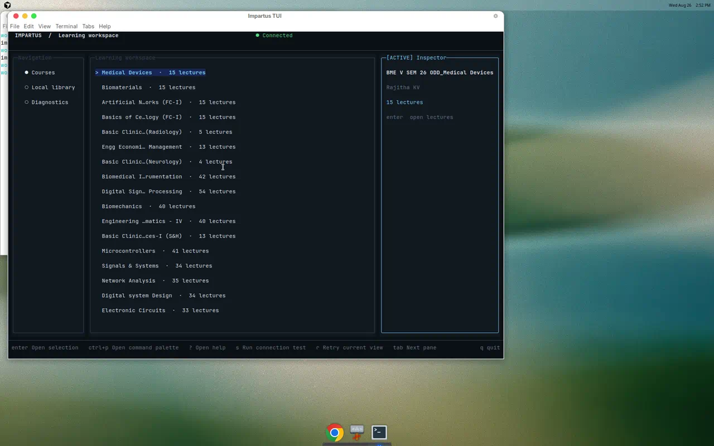

### T7. Wide `g` leaves Navigation focused ([#199](https://github.com/rabesss/impartus-cli/issues/199))


### T6. `/` while filtering inserts a slash ([#200](https://github.com/rabesss/impartus-cli/issues/200))

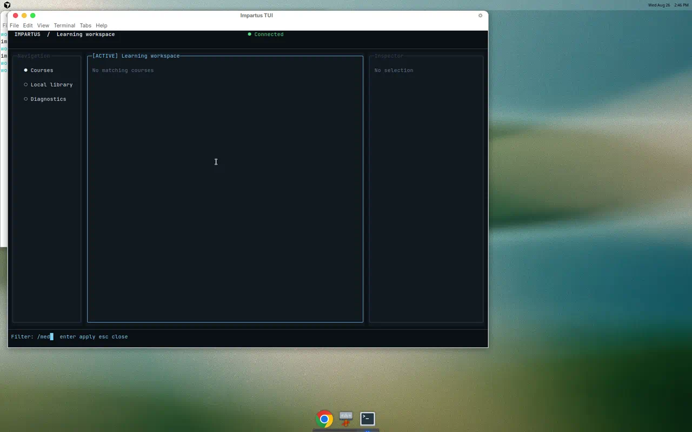


## Grouping rules used

One issue when the user hits one lie (help B2+B3, command chrome T4+T8, crash path T1+T5). Two PRs inside [#197](https://github.com/rabesss/impartus-cli/issues/197) because progress events and Escape-cancel have different file boundaries (`operations.go` vs `ui/src/main.ts`). `SelectRange` stays 0-as-default. Fix B1 at `startSet` / `endSet` in CLI flags only.
