<!-- START doctoc generated TOC please keep comment here to allow auto update -->
<!-- DON'T EDIT THIS SECTION, INSTEAD RE-RUN doctoc TO UPDATE -->
**Table of Contents**  *generated with [DocToc](https://github.com/ktechhub/doctoc)*

<!---toc start-->

* [Impartus-Go System Architecture](#impartus-go-system-architecture)
  * [System Overview](#system-overview)
    * [Package Relationships](#package-relationships)
  * [Core Components](#core-components)
    * [1. CLI Entry Flow](#1-cli-entry-flow)
    * [2. HTTP API Request Flow](#2-http-api-request-flow)
    * [3. Download Pipeline Architecture](#3-download-pipeline-architecture)
    * [4. Job Execution State Machine](#4-job-execution-state-machine)
    * [5. WebSocket Event Flow](#5-websocket-event-flow)
    * [6. Configuration Resolution Flow](#6-configuration-resolution-flow)
  * [Key Packages](#key-packages)
    * [internal/config](#internalconfig)
    * [internal/client](#internalclient)
    * [internal/downloader](#internaldownloader)
    * [internal/server](#internalserver)
    * [internal/cli](#internalcli)
  * [Data Structures](#data-structures)
    * [Config Struct Relationships](#config-struct-relationships)
    * [Download Pipeline Data Flow](#download-pipeline-data-flow)
  * [Error Handling](#error-handling)
    * [Error Propagation Patterns](#error-propagation-patterns)
    * [Retry Logic with Exponential Backoff](#retry-logic-with-exponential-backoff)
    * [Error Response Format (API)](#error-response-format-api)
  * [Rate Limiting](#rate-limiting)
  * [Progress Tracking](#progress-tracking)

<!---toc end-->

<!-- END doctoc generated TOC please keep comment here to allow auto update -->
# Impartus-Go System Architecture

This document provides a comprehensive overview of the impartus-go CLI architecture, designed for developers and AI agents working with the codebase.

## System Overview

Impartus-go is a Go-based video downloader CLI for Impartus lectures. It supports both interactive CLI mode and a JSON mode for AI agent integration, plus an HTTP API server with WebSocket events for programmatic access.

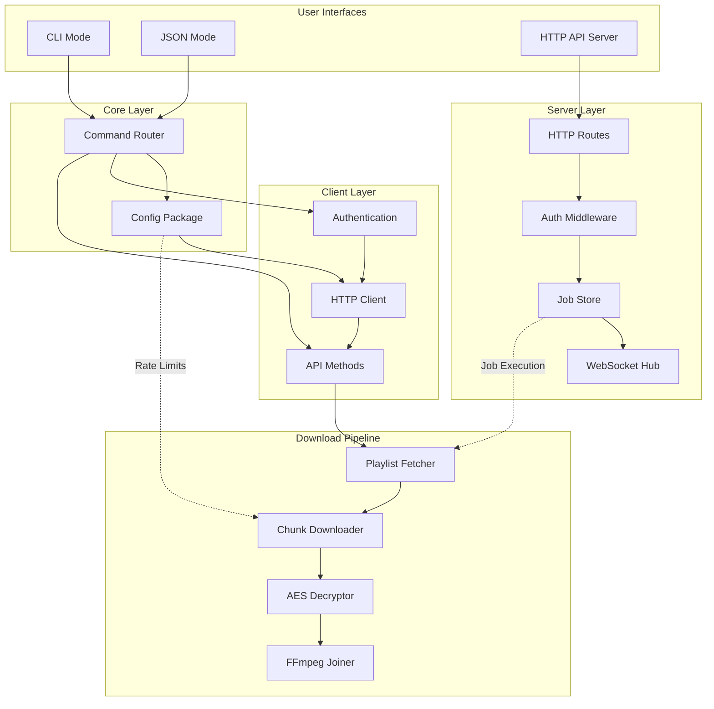

### Package Relationships

| Package | Depends On | Purpose |
|---------|------------|---------|
| `cli` | `config`, `client`, `downloader`, `server` | Command-line interface and JSON envelope output |
| `client` | `config` | HTTP client for Impartus API, authentication, playlist fetching |
| `downloader` | `config`, `client` | Download pipeline, rate limiting, decryption, FFmpeg integration |
| `server` | `config`, `client`, `downloader` | HTTP API server, job management, WebSocket events |
| `config` | - | Configuration loading, validation, environment overrides |

## Core Components

### 1. CLI Entry Flow

The CLI supports two modes: interactive (default) and JSON (for AI agents). The `--json` flag enables machine-readable output.

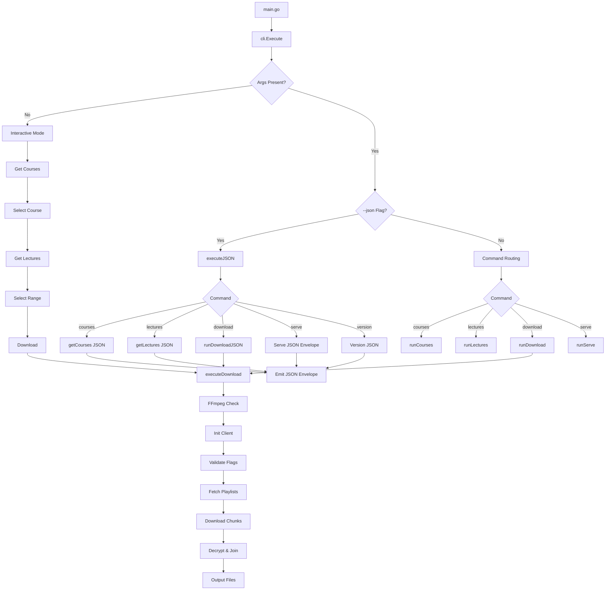

**Key Functions:**

| Function | Location | Purpose |
|----------|----------|---------|
| `Execute()` | `cli/cli.go` | Entry point, routes to interactive or command mode |
| `executeJSON()` | `cli/cli.go` | Handles `--json` flag, outputs JSON envelopes |
| `runInteractive()` | `cli/cli.go` | Interactive course/lecture selection |
| `runServe()` | `cli/cli.go` | Starts HTTP API server |
| `downloadLectures()` | `cli/cli.go` | Orchestrates the download pipeline |

### 2. HTTP API Request Flow

The API server uses middleware for authentication and request tracing.

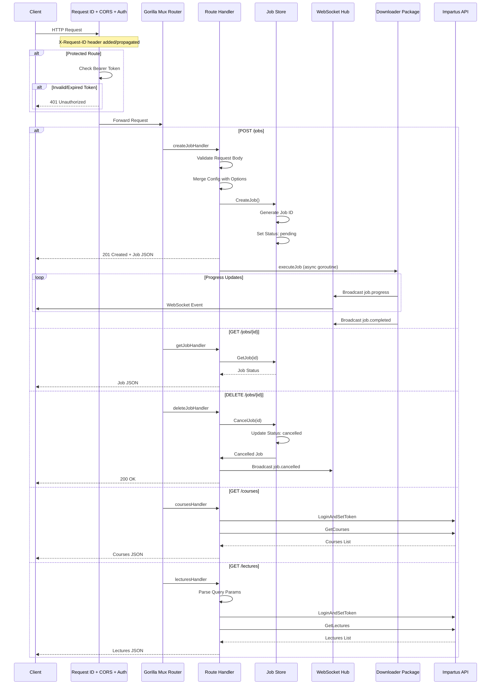

**Authentication Middleware Flow:**

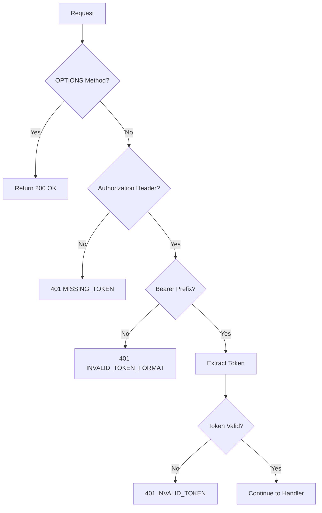

### 3. Download Pipeline Architecture

The download pipeline supports both sequential and parallel (pipelined) processing modes.

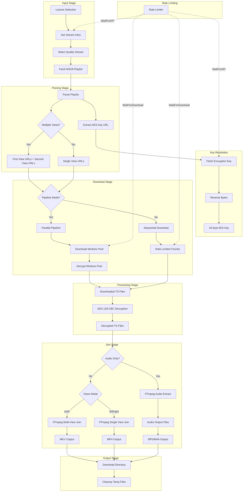

**Pipeline vs Sequential Mode:**

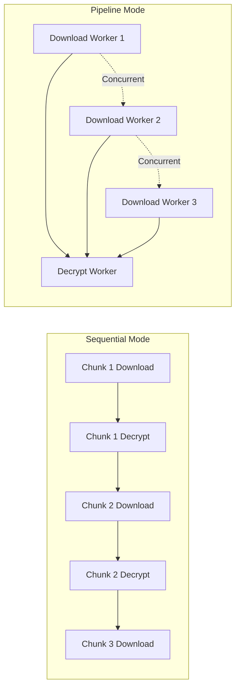

**Pipeline Worker Architecture:**

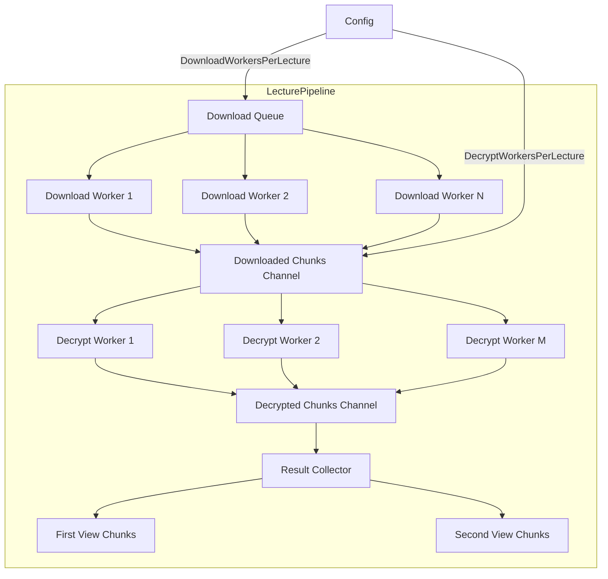

### 4. Job Execution State Machine

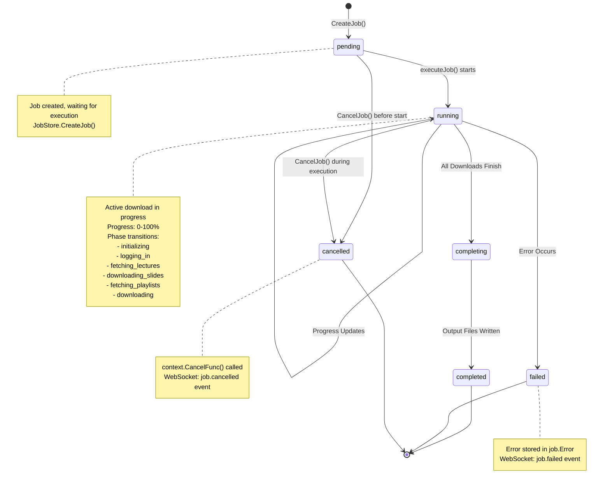

**Job Lifecycle Events:**

| Phase | Progress Range | WebSocket Event |
|-------|----------------|-----------------|
| `initializing` | 0-2% | `job.started` |
| `logging_in` | 2-8% | `job.progress` |
| `fetching_lectures` | 8-15% | `job.progress` |
| `downloading_slides` | 15-25% | `job.progress` (optional) |
| `fetching_playlists` | 25-30% | `job.progress` |
| `downloading` | 30-95% | `job.progress` |
| `completing` | 95-100% | `job.progress` |
| `completed` | 100% | `job.completed` |

### 5. WebSocket Event Flow

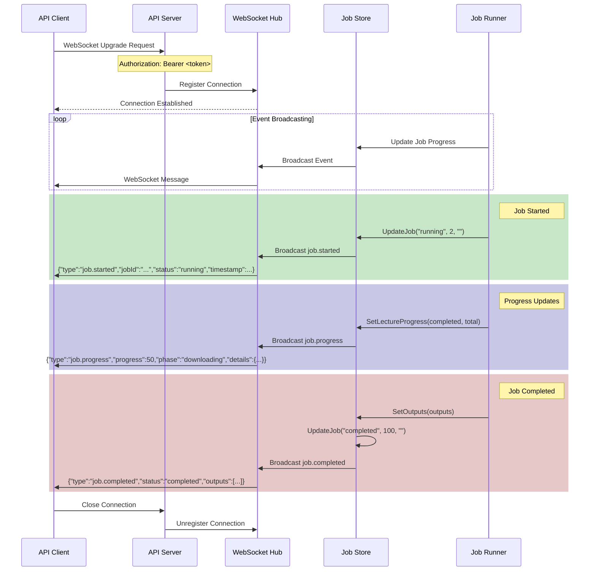

**Event Types:**

| Event | Trigger | Fields |
|-------|---------|--------|
| `job.started` | Job begins execution | `type`, `jobId`, `status`, `timestamp` |
| `job.progress` | Periodic updates | `type`, `jobId`, `status`, `progress`, `phase`, `details?`, `timestamp` |
| `job.completed` | All downloads finish | `type`, `jobId`, `status`, `progress`, `outputs[]`, `timestamp` |
| `job.failed` | Unrecoverable error | `type`, `jobId`, `status`, `error`, `timestamp` |
| `job.cancelled` | User cancellation | `type`, `jobId`, `status`, `progress?`, `timestamp` |

### 6. Configuration Resolution Flow

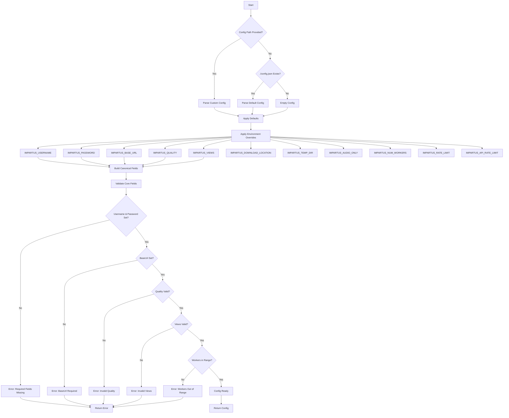

**Configuration Priority:**

1. **CLI Flags** (highest) - `--quality`, `--views`, `--output`, etc.
2. **Environment Variables** - `IMPARTUS_*`
3. **Config File** - `./config.json`
4. **Defaults** (lowest) - Applied after file/env

**Validation Rules:**

| Field | Valid Values | Default |
|-------|--------------|---------|
| `quality` | `144`, `450`, `720` | Required |
| `views` | `left`, `right`, `both`, `first`, `second` | Required |
| `numWorkers` | 1-50 | 5 |
| `downloadWorkersPerLecture` | 1-10 | 3 |
| `decryptWorkersPerLecture` | 1-10 | 2 |
| `rateLimit` | 0.1-100 RPS | 10 |
| `apiRateLimit` | 0.1-20 RPS | 2 |
| `httpTimeout` | 30s-60m | 10m |
| `audioFormat` | `mp3`, `m4a`, `aac`, `opus` (audio-only) | `mp3` |

## Key Packages

### internal/config

**Responsibilities:**
- Load configuration from JSON file
- Apply environment variable overrides
- Validate configuration values
- Provide defaults for missing values

**Key Types:**

```go
type Config struct {
    Username         string
    Password         string
    BaseUrl          string
    Quality          string
    Views            string
    DownloadLocation string
    TempDirLocation  string
    Token            string
    NumWorkers       int
    AudioOnly        bool
    AudioFormat      string
    RateLimit        float64
    APIRateLimit     float64
    EnableJitter     bool
    EnablePipeline   bool
    DownloadWorkersPerLecture int
    DecryptWorkersPerLecture  int
    ProgressTracking ProgressConfig
    HTTPTimeout      string
}

type ProgressConfig struct {
    Enabled         bool
    ShowSpeed       bool
    ShowETA         bool
    UpdateInterval  string
    SpeedWindowSize int
}
```

**Key Functions:**

| Function | Purpose |
|----------|---------|
| `LoadResolved(path)` | Load config from file, apply env overrides and defaults |
| `Load(path)` | Parse and validate config file |
| `Parse(path)` | Parse JSON config file |
| `Validate()` | Validate all config fields |
| `ApplyDefaults()` | Set default values for missing fields |

### internal/client

**Responsibilities:**
- HTTP client for Impartus API
- Authentication and token management
- Course and lecture data retrieval
- Playlist fetching and parsing

**Key Types:**

```go
type Client struct {
    HTTPClient        *http.Client
    UserAgentProvider func() string
    token             string
}

type Course struct {
    SubjectID   int
    SessionID   int
    SubjectName  string
    ProfessorName string
    // ... additional fields
}

type Lecture struct {
    Ttid    int
    Topic   string
    SeqNo   int
    // ... additional fields
}

type ParsedPlaylist struct {
    KeyURL           string
    Title            string
    FirstViewURLs    []string
    SecondViewURLs   []string
    Id               int
    SeqNo            int
    HasMultipleViews bool
}
```

**Key Methods:**

| Method | Purpose |
|--------|---------|
| `LoginAndSetToken(ctx, cfg)` | Authenticate and store bearer token |
| `GetCourses(ctx, cfg)` | Fetch available courses |
| `GetLectures(ctx, cfg, course)` | Fetch lectures for a course |
| `GetPlaylists(ctx, cfg, lectures)` | Fetch and parse M3U8 playlists |
| `GetAuthorizedWithToken(ctx, url, token)` | Make authenticated GET request |

### internal/downloader

**Responsibilities:**
- Download pipeline orchestration
- Rate limiting for API and download requests
- AES-128-CBC decryption
- FFmpeg video/audio joining
- Progress tracking

**Key Types:**

```go
type Downloader struct {
    config      *config.Config
    client      *client.Client
    rateLimiter *RateLimiter
    maxRetries  int
    ffmpegPath  string
}

type LecturePipeline struct {
    config           PipelineConfig
    downloadQueue    chan ChunkTask
    downloadedChunks chan DownloadedChunk
    decryptedChunks  chan DecryptedChunk
    // ...
}

type RateLimiter struct {
    downloadLimiter *rate.Limiter
    apiLimiter      *rate.Limiter
    jitterEnabled   bool
}

type ProgressTracker struct {
    totalLectures     int32
    completedLectures int32
    totalChunks       int32
    completedChunks   int32
    speedSamples      []SpeedSample
    // ...
}
```

**Key Functions:**

| Function | Purpose |
|----------|---------|
| `New(cfg, client)` | Create downloader with config |
| `FetchLecturePlaylists(ctx, lectures)` | Get M3U8 playlists for lectures |
| `DownloadPlaylist(ctx, playlist, progress, tracker)` | Download chunks for one lecture |
| `JoinLectureOutput(file)` | Join downloaded chunks with FFmpeg |
| `decryptChunk(filePath, key)` | AES-128-CBC decryption |

### internal/server

**Responsibilities:**
- HTTP API server
- Job management and execution
- WebSocket hub for real-time events
- Authentication middleware
- Token management

**Key Types:**

```go
type APIServer struct {
    cfg        *config.Config
    jobStore   *JobStore
    wsHub      *WSHub
    tokenStore *TokenStore
    upgrader   websocket.Upgrader
    router     *mux.Router
    port       string
}

type Job struct {
    ID                string
    SubjectID         int
    SessionID         int
    StartIndex        int
    EndIndex          int
    Status            string
    Progress          float64
    Error             string
    TotalLectures     int
    CompletedLectures  int
    Outputs           []string
    Config            JobRuntimeConfig
    CreatedAt         time.Time
    UpdatedAt         time.Time
    ctx               context.Context
    cancel            context.CancelFunc
}

type JobStore struct {
    jobs map[string]*Job
    mu   sync.RWMutex
}

type WSHub struct {
    clients map[*websocket.Conn]bool
    mu      sync.Mutex
}

type TokenStore struct {
    tokens map[string]TokenInfo
    mu     sync.RWMutex
}
```

**Key HTTP Handlers:**

| Handler | Route | Purpose |
|---------|-------|---------|
| `healthHandler` | `GET /health` | Health check endpoint |
| `loginHandler` | `POST /auth/login` | Authenticate and get token |
| `coursesHandler` | `GET /courses` | List available courses |
| `lecturesHandler` | `GET /lectures` | List lectures for course |
| `createJobHandler` | `POST /jobs` | Create download job |
| `listJobsHandler` | `GET /jobs` | List all jobs |
| `getJobHandler` | `GET /jobs/{id}` | Get job status |
| `deleteJobHandler` | `DELETE /jobs/{id}` | Cancel job |
| `websocketHandler` | `GET /ws` | WebSocket connection |

### internal/cli

**Responsibilities:**
- Command-line argument parsing
- Interactive mode prompts
- JSON envelope output
- Flag validation and override

**Key Types:**

```go
type jsonEnvelope struct {
    Success bool     `json:"success"`
    Data    any      `json:"data"`
    Error   *jsonErr `json:"error"`
    Meta    jsonMeta `json:"meta"`
}

type downloadResult struct {
    Status       string   `json:"status"`
    OutputPaths  []string `json:"outputPaths"`
    LectureCount int      `json:"lectureCount"`
}
```

**Key Functions:**

| Function | Purpose |
|----------|---------|
| `Execute(version, date)` | Main CLI entry point |
| `executeJSON(args, version, date)` | Handle `--json` mode |
| `runInteractive()` | Interactive course/lecture selection |
| `runDownload(args)` | CLI download command |
| `runServe(args, version)` | Start API server |

## Data Structures

### Config Struct Relationships

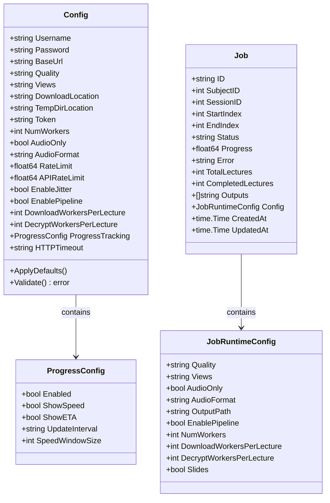

### Download Pipeline Data Flow

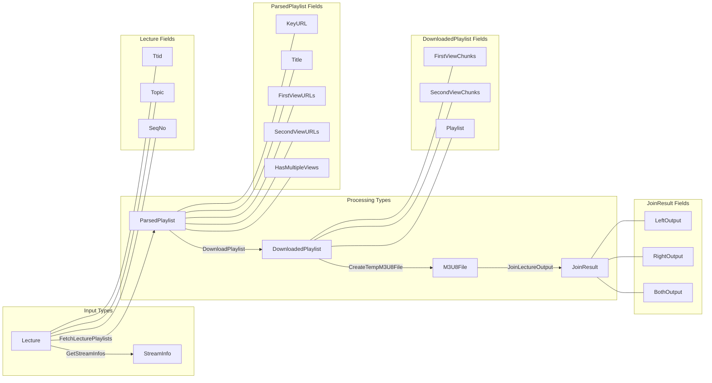

## Error Handling

### Error Propagation Patterns

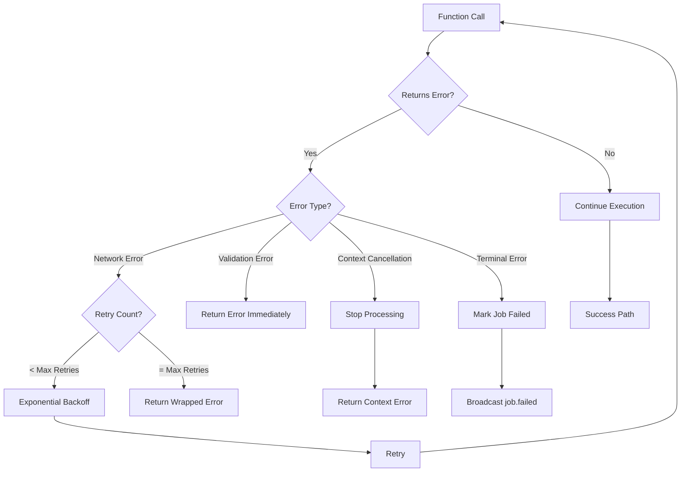

### Retry Logic with Exponential Backoff

```go
// downloadWithRetry implements exponential backoff
func (d *Downloader) downloadWithRetry(ctx context.Context, url string, 
    id, chunk int, view string, maxRetries int, tracker *ProgressTracker) (string, error) {
    var lastErr error
    baseDelay := 1 * time.Second
    
    for attempt := 0; attempt < maxRetries; attempt++ {
        filePath, bytesDownloaded, err := d.downloadURL(ctx, url, id, chunk, view)
        if err == nil {
            if tracker != nil {
                ChunkCompleted(tracker, bytesDownloaded)
            }
            return filePath, nil
        }
        
        lastErr = err
        if attempt < maxRetries-1 {
            delay := retryDelay(baseDelay, attempt)
            time.Sleep(delay)
        }
    }
    
    return "", fmt.Errorf("failed after %d attempts: %w", maxRetries, lastErr)
}

func retryDelay(baseDelay time.Duration, attempt int) time.Duration {
    // Calculate: baseDelay * 2^attempt
    // Capped at ~6 hours to prevent overflow
    multiplier := int64(math.Pow(2, float64(attempt)))
    return time.Duration(int64(baseDelay) * multiplier)
}
```

### Error Response Format (API)

```json
{
    "success": false,
    "error": {
        "code": "ERROR_CODE",
        "message": "Human readable message",
        "details": {}
    }
}
```

**Common Error Codes:**

| Code | HTTP Status | Description |
|------|-------------|-------------|
| `MISSING_TOKEN` | 401 | No Authorization header |
| `INVALID_TOKEN_FORMAT` | 401 | Missing Bearer prefix |
| `INVALID_TOKEN` | 401 | Token expired or invalid |
| `AUTH_FAILED` | 401 | Invalid credentials |
| `MISSING_PARAMETER` | 400 | Required parameter missing |
| `INVALID_REQUEST` | 400 | Malformed request body |
| `JOB_NOT_FOUND` | 404 | Job ID doesn't exist |
| `JOB_CANNOT_CANCEL` | 400 | Job in terminal state |
| `LOGIN_FAILED` | 502 | Authentication with Impartus failed |
| `COURSES_FETCH_FAILED` | 502 | Failed to fetch courses |
| `LECTURES_FETCH_FAILED` | 502 | Failed to fetch lectures |

## Rate Limiting

The system implements rate limiting at two levels:

1. **API Rate Limit** - Controls requests to Impartus API
2. **Download Rate Limit** - Controls chunk download concurrency

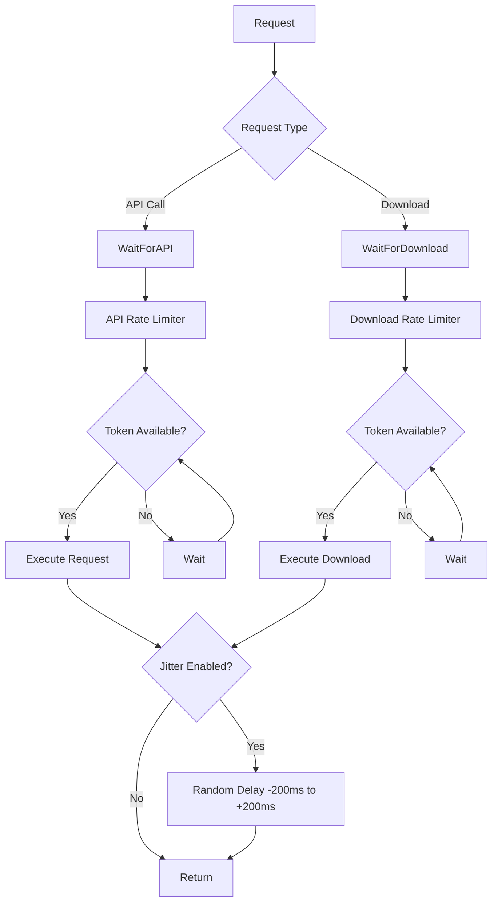

## Progress Tracking

The progress tracker provides real-time feedback during downloads:

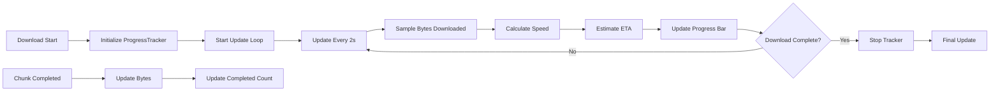

**Metrics Tracked:**

| Metric | Formula |
|--------|---------|
| Progress % | `(completedChunks / totalChunks) * 100` |
| Speed | `Δbytes / Δtime` over sliding window |
| ETA | `remainingBytes / speed` |
| Elapsed | `time.Since(startTime)` |

---

*This documentation reflects the architecture as of the current implementation. For API-specific details, see [api-reference.md](api-reference.md). For WebSocket event specifications, see [websocket-events.md](websocket-events.md).*
