# Dogfood Report: impartus-cli (public product)

| Field | Value |
|-------|-------|
| **Date** | 2026-08-21 |
| **App URL** | local CLI/TUI `./impartus` plus loopback HTTP API `http://127.0.0.1:8080` (no hosted web app) |
| **Session** | `impartus-api` (agent-browser); xfce4-terminal on `DISPLAY=:1` for CLI/TUI |
| **Scope** | Public `rabesss/impartus-cli` only, black-box as a normal end user. Private lecture-worker, Drive, NotebookLM, AGY, Railway, and Obsidian systems out of scope. No live Impartus credentials were requested, copied, invented, or used in recorded tests. |

## Summary

| Severity | Count |
|----------|-------|
| Critical | 0 |
| High | 0 |
| Medium | 3 |
| Low | 4 |
| **Total** | **7** |

OpenTUI course/lecture/playback/library/command-guide chrome was **not entered**. `impartus tui` exits before the workspace whenever credentials are missing or the published sample placeholders are used. Those surfaces are blocked in `coverage-matrix.md` rather than marked covered.

## Issues

### ISSUE-001: Subcommand `--help` does not show help

| Field | Value |
|-------|-------|
| **Severity** | medium |
| **Category** | ux |
| **URL** | CLI: `impartus <subcommand> --help` |
| **Repro Video** | N/A |

**Description**

A first-run user who types the usual `--help` on a subcommand does not get usage. Root `impartus help` works and lists flags, so there is a workaround, but several entry points fail in different ways:

- `download --help`, `play --help`, `watch --help`, and `serve --help` print `flag: help requested` and exit 1.
- `tui --help` and `version --help` print `<command> does not accept positional arguments` and exit 1.
- `library --help` prints `unknown library command: --help` and exit 1.

Expected: command-specific help (or at least the root usage text) and a success or well-documented help exit. Actual: opaque one-liners that look like failures.

**Repro Steps**

1. From a terminal, with no config required, run `impartus help` and confirm flags exist.
   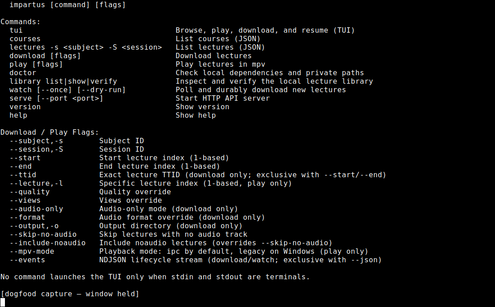

2. Run `impartus download --help`.
   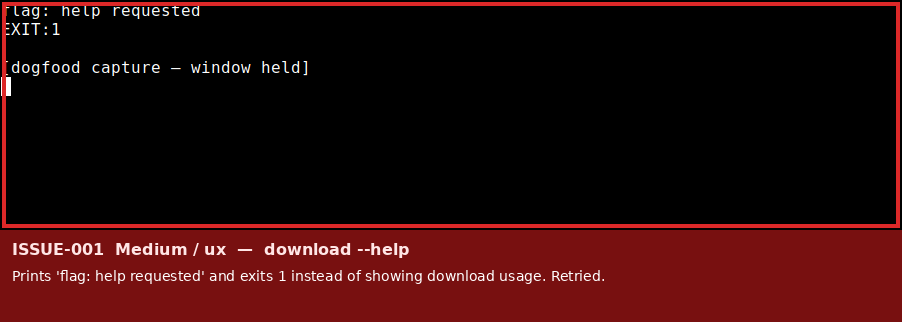

3. Run `impartus tui --help`.
   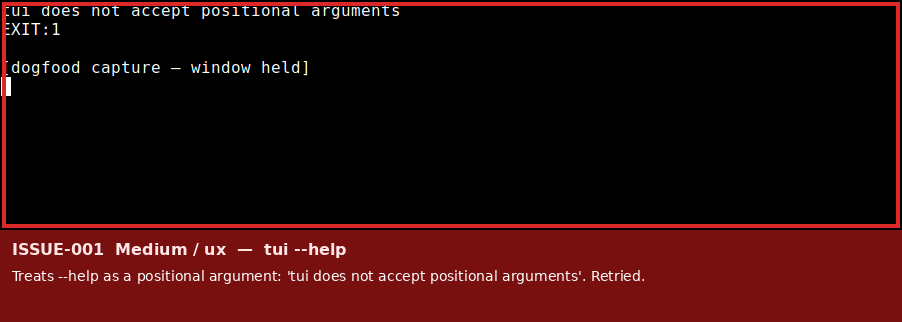

4. Run `impartus library --help`.
   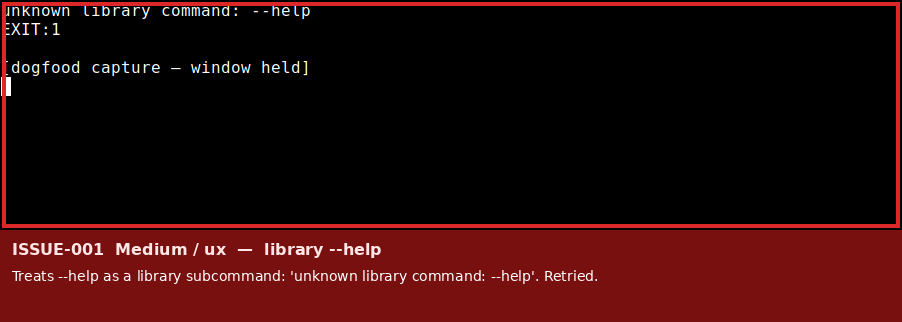

5. Retry: `impartus version --help` and `impartus watch --help` fail the same way.
   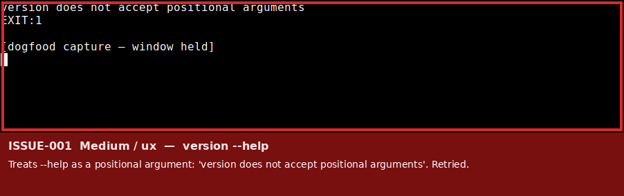
   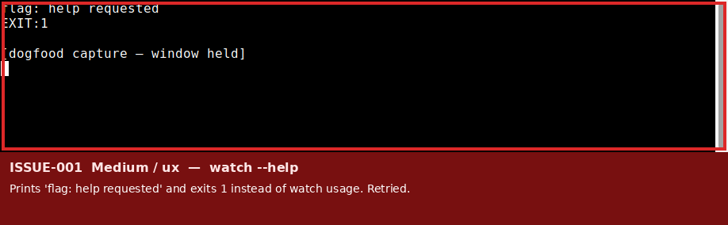

---

### ISSUE-002: TUI never enters OpenTUI on missing or wrong credentials

| Field | Value |
|-------|-------|
| **Severity** | medium |
| **Category** | ux |
| **URL** | CLI: `impartus tui` |
| **Repro Video** | N/A |

**Description**

README describes a desktop-style OpenTUI workspace with `?` command guide, `/` filter, `l` library, `!` diagnostics, and playback chrome. With no credentials, `impartus tui` prints `username and password are required` and exits 1. With the published `sample.config.json` placeholders, it prints `wrong credentials please retry` and exits 1.

There is no OpenTUI loading, error, or retry surface. Keyboard help, layout routing, and recovery are unreachable until a live Impartus login succeeds. That also means a missing `impartus-ui` sidecar cannot be diagnosed from `tui` until auth succeeds (no-config and sample-config retries both died on credentials first).

**Repro Steps**

1. Unset `IMPARTUS_USERNAME` / `IMPARTUS_PASSWORD` / `IMPARTUS_BASE_URL`, ensure no `config.json`, run `impartus tui` in a real terminal.
   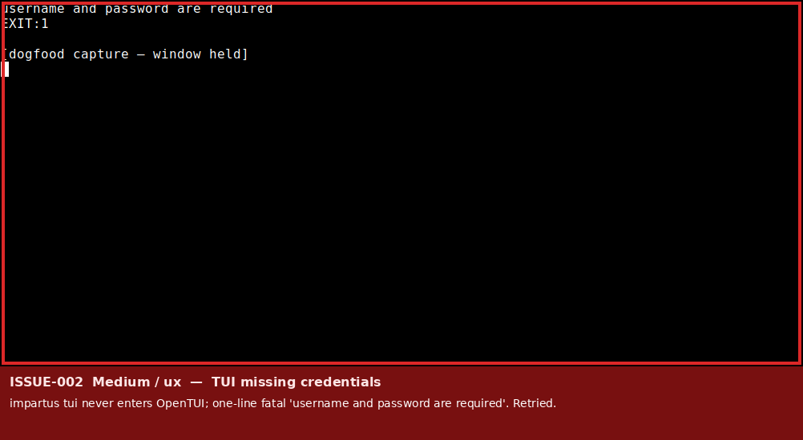

2. Retry with the published sample config (placeholder username/password only).
   

---

### ISSUE-003: Root help sentence is hard to parse

| Field | Value |
|-------|-------|
| **Severity** | low |
| **Category** | content |
| **URL** | CLI: `impartus help` |
| **Repro Video** | N/A |

**Description**

Help ends with `No command launches the TUI only when stdin and stdout are terminals.` The intended rule (no-argument TUI is TTY-only) is documented in the README more clearly. As printed, the sentence is easy to misread. Invalid-command and non-TTY no-args paths reprint the same text.

**Repro Steps**

1. Run `impartus help` (and retry `impartus notacommand`).
   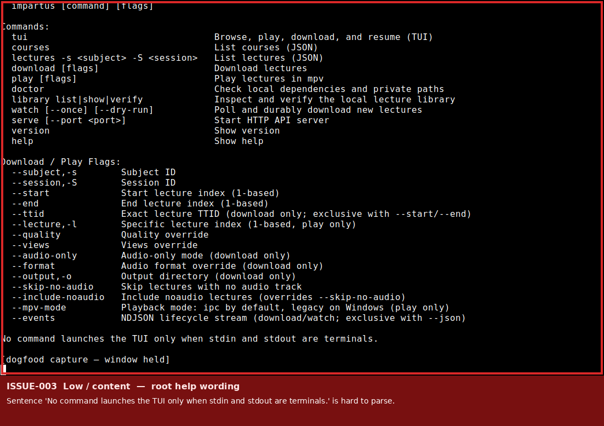

---

### ISSUE-004: Version prints an empty Build Date after `make build`

| Field | Value |
|-------|-------|
| **Severity** | low |
| **Category** | content |
| **URL** | CLI: `impartus version` |
| **Repro Video** | N/A |

**Description**

README's source-install path is `make build`. The resulting binary prints `Version: 0.1.25` and `Build Date:` with no date. `make build-release` is a separate target that stamps ldflags; a user following Quick Start still sees a blank field.

**Repro Steps**

1. Build with `make build`, run `impartus version`.
   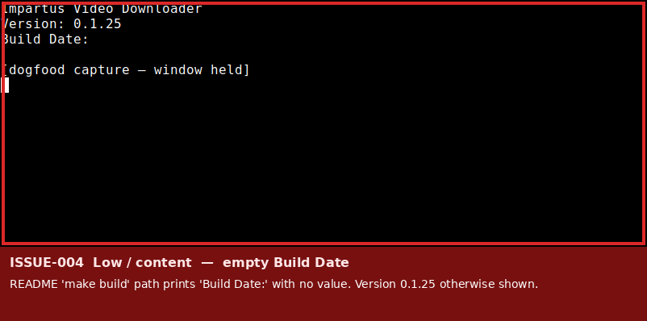

---

### ISSUE-005: `library verify` is silent on an empty library

| Field | Value |
|-------|-------|
| **Severity** | low |
| **Category** | ux |
| **URL** | CLI: `impartus library verify` |
| **Repro Video** | N/A |

**Description**

`impartus library list` reports `Library is empty.` `impartus library verify` on the same empty store exits 0 with no text. A user can think the command did nothing.

**Repro Steps**

1. With a fresh state directory, run `impartus library list`.
   

2. Run `impartus library verify`.
   

---

### ISSUE-006: API job failure text is generic compared with CLI

| Field | Value |
|-------|-------|
| **Severity** | medium |
| **Category** | ux |
| **URL** | `http://127.0.0.1:8080/api/v1/jobs/{id}` |
| **Repro Video** | N/A |

**Description**

The same published sample placeholders fail CLI download/events with `wrong credentials please retry`. Creating a download job through the local API (no real media was written) fails the job with `error: "upstream API error"`. GET job still returns HTTP 200 / `"success": true` with `data.status: "failed"`, which is envelope-correct, but the job error string is not actionable. `GET /api/v1/courses` with the same local API token is clearer: `LOGIN_FAILED` / `Failed to authenticate with Impartus API`.

**Repro Steps**

1. Start `impartus serve` using only `sample.config.json` placeholders (not live env credentials).

2. POST `/api/v1/auth/login` with those placeholders, then POST `/api/v1/jobs` with fake `subjectId`/`sessionId` 1 (this does not download lecture media).

3. GET the job. Observe `status: failed` and `error: "upstream API error"`.
   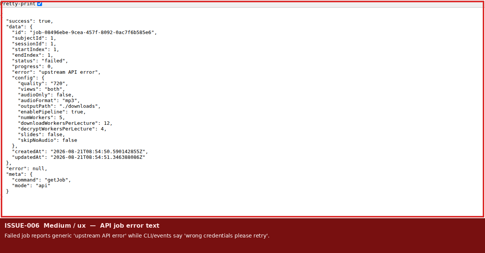

4. Contrast CLI `download --events` with the same sample config, which names wrong credentials.
   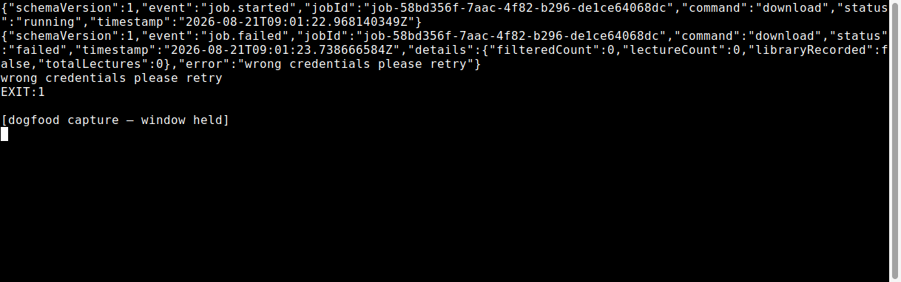

---

### ISSUE-007: `download --events` duplicates the error outside NDJSON

| Field | Value |
|-------|-------|
| **Severity** | low |
| **Category** | ux |
| **URL** | CLI: `impartus download --events` |
| **Repro Video** | N/A |

**Description**

`--events` correctly emits `job.started` then `job.failed` with `"error":"wrong credentials please retry"` and does not write media. After the NDJSON records, the same sentence is printed again as unstructured text. Callers parsing stdout as a pure event stream have to tolerate a trailing human line.

**Repro Steps**

1. With published sample config only, run `impartus download -s 1 -S 1 --events`.
   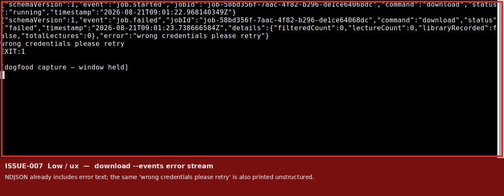

---

## Notes (not filed as issues)

- Cloud VM had `IMPARTUS_USERNAME` / `IMPARTUS_PASSWORD` / `IMPARTUS_BASE_URL` set. They were unset for every recorded screenshot. An accidental first `courses` probe using those env vars is not included in artifacts (private lecture metadata).
- `impartus serve --json` reports `"status":"ready"` without binding a port; the payload's `note` field documents non-blocking JSON mode.
- Readiness `/api/v1/health/ready` can be `"ok"` / `upstream.reachable` for sample config even when Impartus login fails. That matches README (reachability, not login).
- Direct `impartus-ui` without the parent bootstrap prints `impartus-ui: terminal frontend failed during bootstrap` (covered as an error state).
- No JavaScript console errors on the JSON API responses viewed in Chrome.
